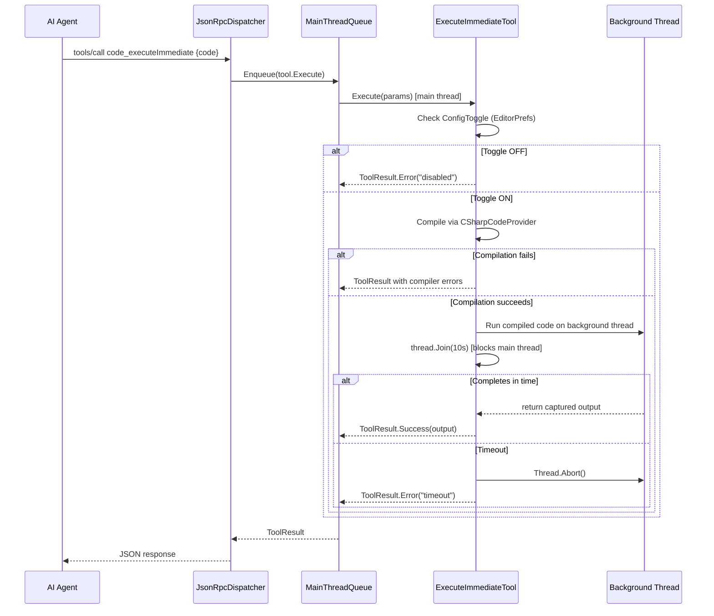

# Design Document: code-execute-immediate

## Overview

This feature adds an MCP tool `code_executeImmediate` that dynamically compiles and executes C# code snippets inside the Unity Editor at runtime. It enables AI agents to run arbitrary Editor logic (batch scene edits, asset queries, custom inspections) without creating persistent script files. The code may be written by a human developer or generated by an AI agent (e.g., for automated debugging, data inspection, or batch operations).

The tool uses Mono's `CSharpCodeProvider` for runtime compilation, which is only available on Unity 2022 (Mono backend). The entire tool class is excluded from Unity 6+ (CoreCLR) via `#if !UNITY_6000_OR_NEWER`. A ConfigPanel toggle (default OFF) acts as the safety gate.

Key design challenge: `IMcpTool.Execute()` runs on the main thread (dispatched by `JsonRpcDispatcher` via `MainThreadQueue`). We need a timeout mechanism that doesn't permanently block the main thread if user code enters an infinite loop.

## Out of Scope

The following are explicitly not supported in this MVP:

- **Unity API calls from compiled code** — user code runs on a background thread; Unity API requires the main thread. Use existing dedicated MCP tools for scene/asset operations.
- **Async entry points** — `async Run()` or `Task`-returning methods are not supported. The entry point must be `public static void Run()`.
- **External NuGet / package references** — only assemblies already loaded in the Editor's AppDomain are referenced.
- **Multi-file compilation** — only a single `code` string is accepted per invocation.
- **Return value mechanism** — no "last expression auto-return". Use `Console.WriteLine` for output.
- **Configurable timeout** — hardcoded at 10 seconds. May be made configurable in a future version.
- **Assembly whitelist / sandbox** — currently all loaded assemblies are referenced, meaning compiled code can access file I/O, networking, etc. The ConfigPanel toggle (default OFF) is the primary safety gate. A finer-grained assembly whitelist or sandbox mechanism may be added in a future version if the tool is opened to less-trusted callers.

## Architecture

### Execution Flow



### Thread Model Decision

The compiled user code runs on a **background thread**, not the main thread. Rationale:

1. The main thread cannot be aborted — `Thread.Abort()` on the main thread would kill the Editor.
2. A background thread can be aborted after timeout, preventing infinite loops from freezing the Editor.
3. Tradeoff: compiled code cannot directly call Unity API (which requires main thread). This is acceptable because the primary use case is data processing, queries, and `Console.WriteLine` output. If Unity API access is needed, the agent should use the existing dedicated MCP tools instead.

Compilation itself (via `CSharpCodeProvider`) runs on the main thread since it's fast and deterministic.

**`Thread.Abort()` limitations**: `Thread.Abort()` is best-effort — it cannot interrupt non-managed blocking calls (e.g., native code) and may leave state inconsistent if the thread is inside a `finally` block. This is an accepted limitation for the MVP. The timeout error message should advise the agent to restart the MCP Server if subsequent executions behave unexpectedly.

**Main thread blocking**: `thread.Join(timeout)` blocks the Editor UI for up to 10 seconds. This is a known limitation of the synchronous design. A future version could use `Task.Run` + `await` to yield back to the main thread during the wait, but the current MVP chooses synchronous `Join` to keep complexity low.

## Components and Interfaces

### 1. ExecuteImmediateTool

- File: `Editor/Tools/ExecuteImmediateTool.cs`
- Namespace: `UnityMcp.Editor.Tools`
- Entire file wrapped in `#if !UNITY_6000_OR_NEWER`
- Implements `IMcpTool`

```
Name:        "code_executeImmediate"
Category:    "code"
Description: "Compile and execute C# code at runtime (experimental, Mono only)"
InputSchema: { "type": "object", "properties": { "code": { "type": "string", "description": "C# source code to compile and execute" } }, "required": ["code"] }
```

Execute() pseudocode:
```
private static readonly object _executionLock = new object()

Execute(params):
    code = params["code"] as string
    if code is null or empty → return error "missing 'code' parameter"
    if EditorPrefs.GetBool(PREF_KEY, false) == false → return error "feature disabled"

    lock (_executionLock):
        // Compile
        result = CompileCode(code)
        if result.Errors.HasErrors → return error with formatted compiler errors

        // Find entry point
        entryPoint = FindEntryPoint(result.CompiledAssembly)
        if entryPoint is null → return error "no entry point found"

        // Execute on background thread with timeout
        (output, error) = RunWithTimeout(entryPoint, timeout: 10s)
        return BuildResponse(output, error)
```

The `_executionLock` ensures only one `code_executeImmediate` invocation runs at a time, preventing `Console.SetOut` race conditions when multiple agents call the tool concurrently. Concurrent callers block on the lock; worst-case wait is ~10s (timeout) + compilation time of the preceding invocation.

### 2. Compilation Logic

Uses `Microsoft.CSharp.CSharpCodeProvider` with `CompilerParameters`:

```
CompileCode(source):
    provider = new CSharpCodeProvider()
    options = new CompilerParameters()
    options.GenerateInMemory = true
    options.GenerateExecutable = false

    // Reference all loaded assemblies (UnityEngine, UnityEditor, project types)
    // Skip mscorlib.dll — mcs implicitly references it; adding it again causes
    // "The imported type is defined multiple times" (CS0433) errors.
    for each assembly in AppDomain.CurrentDomain.GetAssemblies():
        if assembly.IsDynamic → skip
        if assembly.Location is empty → skip
        if assembly file name is "mscorlib.dll" → skip
        options.ReferencedAssemblies.Add(assembly.Location)

    return provider.CompileAssemblyFromSource(options, source)
```

Compilation runs synchronously on the main thread. Expected duration is < 1s for small code snippets with in-memory generation, though the number of referenced assemblies may affect performance. If compilation latency becomes a concern in practice, it can be moved to a background thread in a future iteration.

### 3. Entry Point Resolution

The tool looks for a static method to invoke in the compiled assembly:

```
FindEntryPoint(assembly):
    // Search all types for a static void Run() method
    for each type in assembly.GetTypes():
        method = type.GetMethod("Run", Static | Public, null, Type.EmptyTypes, null)
        if method != null → return method
    return null
```

Convention: the submitted code must contain a class with a `public static void Run()` method.

### 4. Background Thread Execution with Timeout

```
RunWithTimeout(method, timeout):
    originalOut = Console.Out
    writer = new StringWriter()
    try:
        Console.SetOut(writer)

        thread = new Thread(() =>
            try:
                method.Invoke(null, null)
            catch Exception ex:
                store exception
        )
        thread.IsBackground = true
        thread.Start()
        finished = thread.Join(timeout)

        output = writer.ToString()

        if not finished:
            thread.Abort()
            return (output, "Execution timed out (10s). Consider restarting MCP Server if subsequent executions behave unexpectedly.")
        if stored exception:
            return (output, exception.Message + "\n" + exception.StackTrace)
        return (output, "")
    finally:
        Console.SetOut(originalOut)
```

Key points:
- `Console.Out` redirect and restore are inside a `try/finally` block, guaranteeing restoration
- The entire compile-execute flow is protected by `_executionLock` to prevent `Console.SetOut` race conditions
- `Thread.Join(timeout)` blocks the calling (main) thread for at most `timeout`
- On timeout, `Thread.Abort()` raises `ThreadAbortException` in the background thread (best-effort)
- The main thread is blocked for at most 10 seconds, which is within `MainThreadQueue`'s own 10s timeout. Since `MainThreadQueue` checks timeout at dequeue time (before execution starts), and our tool's execution takes at most 10s, the total time is acceptable.

### 5. ConfigPanel Toggle

- File: `Editor/UI/ConfigPanel.cs` (modify existing)
- Add a toggle in the `OnGUI` method, wrapped in `#if !UNITY_6000_OR_NEWER`
- EditorPrefs key: `"McpServer_CodeExecuteImmediate"` (default: false)
- Displayed after the existing status/config section, labeled as experimental

### 6. Response Builder

```
BuildResponse(output, error):
    json = { "success": error == "", "output": output ?? "", "error": error ?? "" }
    // Serialize using MiniJson.SerializeString for each field
    return ToolResult.Success(jsonString)
```

All application-level results (including errors) are returned via `ToolResult.Success(jsonString)` with the `success` field inside the JSON indicating outcome. This matches the `CompileTool` pattern. The only exception: when the toggle is OFF, return `ToolResult.Error("...")` since the tool is fundamentally unavailable.

## Data Models

### Input

| Field  | Type   | Required | Description                          |
|--------|--------|----------|--------------------------------------|
| `code` | string | Yes      | C# source code to compile and execute |

### Output (Tool_Response JSON)

| Field     | Type    | Description                                                    |
|-----------|---------|----------------------------------------------------------------|
| `success` | boolean | `true` if code compiled and executed without errors            |
| `output`  | string  | Captured `Console.Out` text during execution                   |
| `error`   | string  | Empty on success; compiler errors, exception, or timeout message on failure |

### EditorPrefs Keys

| Key                              | Type | Default | Description                    |
|----------------------------------|------|---------|--------------------------------|
| `McpServer_CodeExecuteImmediate` | bool | false   | Enable/disable the tool        |


## Correctness Properties

*A property is a characteristic or behavior that should hold true across all valid executions of a system — essentially, a formal statement about what the system should do. Properties serve as the bridge between human-readable specifications and machine-verifiable correctness guarantees.*

### Property 1: Output capture round-trip

*For any* random non-empty string `s`, if we construct valid C# source code containing `Console.WriteLine(s)` inside a `Run()` method and execute it via the tool (with toggle ON), the returned JSON's `output` field SHALL contain `s` followed by a newline, and `success` SHALL be `true`.

**Validates: Requirements 1.1, 2.1, 2.2**

### Property 2: Console.Out restoration invariant

*For any* code execution (whether it succeeds, throws an exception, or produces compilation errors), `Console.Out` SHALL be the same object after `Execute()` returns as it was before `Execute()` was called.

**Validates: Requirements 2.4**

### Property 3: Exception preserves partial output and reports error

*For any* random string `s` and random exception message `msg`, if we construct C# code that first writes `s` to Console then throws an exception with message `msg`, the returned JSON SHALL have `success` = `false`, `output` containing `s`, and `error` containing `msg`.

**Validates: Requirements 2.3**

### Property 4: Toggle OFF rejects all inputs

*For any* string provided as the `code` parameter, when the Config_Toggle EditorPrefs key is `false`, the tool SHALL return an error indicating the feature is disabled, without attempting compilation.

**Validates: Requirements 4.3**

### Property 5: Response format invariant

*For any* invocation of the tool where the Config_Toggle is ON (valid code, invalid code, empty code), the returned text SHALL be valid JSON containing exactly three keys: `success` (boolean), `output` (string), and `error` (string). Toggle OFF invocations return `ToolResult.Error` (plain text) and are excluded from this property.

**Validates: Requirements 7.1, 7.2, 7.3**

## Error Handling

| Scenario                  | Behavior                                                                 |
|---------------------------|--------------------------------------------------------------------------|
| `code` parameter missing  | Return `success: false`, `error: "missing 'code' parameter"`             |
| Toggle OFF                | Return `ToolResult.Error(...)` with message that feature is disabled     |
| Compilation errors        | Return `success: false`, `error` contains all compiler errors with line numbers |
| No `Run()` entry point    | Return `success: false`, `error: "No entry point found..."`              |
| Runtime exception         | Return `success: false`, `output` = partial captured output, `error` = exception message + stack trace |
| Execution timeout (10s)   | Abort background thread, return `success: false`, `output` = partial output, `error` = timeout message with duration |
| `Console.Out` corruption  | Always restored in a `finally` block, even on timeout or abort           |
| Dynamic assembly location | Skip assemblies where `IsDynamic` is true or `Location` is empty when building reference list |

## Acceptance Test Matrix

| # | Scenario | Input | Expected Result |
|---|----------|-------|-----------------|
| 1 | Toggle OFF | Any code string | `ToolResult.Error` with "feature is disabled" message |
| 2 | Missing `code` param | Empty/null params | `success: false`, `error: "missing 'code' parameter"` |
| 3 | Compilation error | `"invalid c# code {"` | `success: false`, `error` contains compiler error with line number |
| 4 | No `Run()` method | `"class Foo { }"` | `success: false`, `error` contains "No entry point found" |
| 5 | Successful execution | Valid code with `Console.WriteLine("hello")` in `Run()` | `success: true`, `output: "hello\n"`, `error: ""` |
| 6 | Runtime exception | Code that throws `new Exception("boom")` in `Run()` | `success: false`, `error` contains "boom" and stack trace, `output` contains any prior output |
| 7 | Execution timeout | Code with `while(true){}` in `Run()` | `success: false`, `error` contains "timed out" and "10s", returns within ~10s |

## Testing Strategy

### Property-Based Tests

Library: NUnit with a simple random generator helper (no external PBT framework needed — Unity Test Runner supports NUnit; we use a loop of 100+ iterations with `System.Random` to generate inputs, matching the project's existing property test pattern).

Each property test runs a minimum of 100 iterations and is tagged with `[Category("Slow")]`.

Tag format: `// Feature: code-execute-immediate, Property {N}: {title}`

| Property | Test Description | Iterations |
|----------|-----------------|------------|
| 1 | Generate random strings, build valid C# source, execute, verify output contains the string | 100 |
| 2 | Execute various code paths (valid, invalid, exception-throwing), verify Console.Out is restored | 100 |
| 3 | Generate random (message, output) pairs, build exception-throwing code, verify partial output and error | 100 |
| 4 | Generate random code strings with toggle OFF, verify all rejected | 100 |
| 5 | Execute with various inputs (valid, invalid, empty), parse response JSON, verify exactly 3 fields with correct types | 100 |

### Unit Tests (Example-Based)

| Test | Description |
|------|-------------|
| Name and Category | Assert `Name == "code_executeImmediate"` and `Category == "code"` |
| InputSchema | Parse schema JSON, verify `code` is required string parameter |
| ToolRegistry auto-discovery | Run `AutoDiscover()`, verify tool is registered |
| Compilation error format | Submit invalid code, verify error contains line numbers |
| Timeout behavior | Submit infinite-loop code, verify timeout response within ~10s |
| Missing code parameter | Call with empty params, verify error response |
| Assembly references | Submit code that uses `UnityEngine.Debug`, verify it compiles |
| Entry point missing | Submit code with no `Run()` method, verify error |
