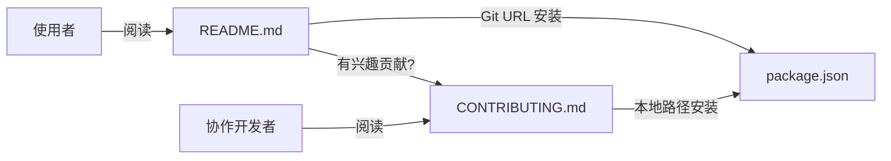

# 设计文档：分离 Git 远程安装与本地协作开发模式

## 概述

本设计将当前仓库的文档体系从"单一 README 混合受众"重构为"README 面向使用者 + CONTRIBUTING.md 面向协作开发者"的双文档结构。同时确保 `package.json` 满足 UPM Git URL 安装的全部要求，并在 README 中补充版本更新指引。

涉及变更的文件：

| 文件 | 操作 |
|------|------|
| `package.json` | 审查并补全字段 |
| `README.md` | 重构内容结构 |
| `README_EN.md` | 新建（README 英文版） |
| `CONTRIBUTING_EN.md` | 新建（CONTRIBUTING 英文版） |
| `.kiro/steering/*.md` | 内容翻译为英文 |
| `.kiro/skills/spec-post-check/SKILL.md` | 内容翻译为英文，补充 CONTRIBUTING 检查步骤 |

## 架构

本特性不涉及代码架构变更，仅涉及文档和配置文件的重组。整体结构如下：

```
仓库根目录/
├── package.json          # UPM 包清单（确保 Git URL 兼容）
├── README.md             # 面向使用者的主文档
├── CONTRIBUTING.md        # 面向协作开发者的贡献指南
├── Editor/               # 插件源码（不变）
└── Tests/                # 测试代码（不变）
```



## 组件与接口

### 1. package.json 字段审查

根据 [Unity 官方文档](https://docs.unity3d.com/6000.4/Documentation/Manual/upm-manifestPkg.html)，UPM 必需字段为 `name` 和 `version`。推荐字段包括 `displayName`、`description`、`unity`。

当前 `package.json` 状态审查：

| 字段 | 要求 | 当前值 | 状态 |
|------|------|--------|------|
| `name` | 必需，反向域名格式 | `com.yangfch3.unity-mcp` | ✅ |
| `version` | 必需，semver | `0.1.0` | ✅ |
| `displayName` | 推荐 | `Unity MCP Server` | ✅ |
| `description` | 推荐 | 已填写 | ✅ |
| `unity` | 推荐，最低版本 | `2022.3` | ✅ |

结论：当前 `package.json` 已满足 Git URL 安装要求，无需修改。

### 2. README.md 重构方案

重构后的 README 章节结构：

```
# Unity MCP Server
  （项目简介 — 保留现有内容）

## 特性
  （保留现有内容）

## 安装
  ### Git URL 安装（推荐）        ← 新增，置于首位
  ### 本地路径安装                 ← 从原"安装"章节保留

## 版本更新                        ← 新增章节
  - 版本锁定机制说明：UPM 首次安装后会在 packages-lock.json 中锁定 commit hash
  - Git Tag 指定版本示例：
    UPM GUI 输入：`https://github.com/<owner>/unity-mcp.git#v0.1.0`
    或直接编辑宿主项目 Packages/manifest.json：
    ```json
    {
      "dependencies": {
        "com.yangfch3.unity-mcp": "https://github.com/<owner>/unity-mcp.git#v0.1.0"
      }
    }
    ```
    不带 Tag 则跟踪默认分支最新 commit：
    ```json
    {
      "dependencies": {
        "com.yangfch3.unity-mcp": "https://github.com/<owner>/unity-mcp.git"
      }
    }
    ```
  - 更新操作方式：修改 manifest.json 中的 `#tag` 后缀，或在 UPM GUI 重新 Add package from git URL 输入新 Tag

## 使用
  （保留现有内容）

## 扩展：添加自定义工具
  （保留现有内容）

## 要求
  （保留现有内容）

## 参与贡献                        ← 替换原"协作开发"章节
  （一句话引导 + 链接到 CONTRIBUTING.md）

## License
  （保留）
```

关键变更点：
- 移除"项目结构"章节（迁移至 CONTRIBUTING.md）
- 移除"协作开发"章节（迁移至 CONTRIBUTING.md）
- 新增"Git URL 安装"子章节，置于安装章节首位
- 新增"版本更新"章节
- "参与贡献"章节仅保留引导链接

### 3. CONTRIBUTING.md 内容结构

```
# 贡献指南

## 开发环境搭建
  - 克隆仓库
  - 本地路径安装到宿主项目

## 启用 Package 内置测试
  - testables 配置说明

## 项目结构
  （从 README 迁移）

## 编码规范
  - 命名空间
  - 日志前缀
  - 工具命名规则
  - 文件编码要求

## 分支管理
  - main 分支作为开发主线
  - 发布时在 main 上打 Git Tag（v{major}.{minor}.{patch}）
```

## 数据模型

本特性不涉及数据模型变更。唯一的结构化数据是 `package.json`，其 schema 已在上文"package.json 字段审查"中描述，当前已满足要求。

## 错误处理

本特性为纯文档重构，不涉及运行时错误处理。

潜在风险及应对：

| 风险 | 应对 |
|------|------|
| Git URL 安装失败 | 验收时实际执行 Git URL 安装测试 |
| README 中链接失效 | 使用相对路径链接 CONTRIBUTING.md |
| package.json 格式错误 | 修改后通过 UPM 解析验证 |

## 测试策略

本特性为文档重构和配置验证，不涉及可执行代码逻辑，不适用属性基测试（PBT）。原因：
- 变更对象为 Markdown 文档和 JSON 配置文件
- 无函数输入/输出行为可测试
- 验证方式为人工审查和实际安装测试

验证方式：

1. **package.json 验证**：在一个干净的 Unity 项目中通过 `Add package from git URL` 安装本仓库，确认 UPM 能正确解析
2. **README 内容审查**：人工检查章节结构是否符合设计，Git URL 是否正确，链接是否有效
3. **CONTRIBUTING.md 内容审查**：人工检查是否包含所有从 README 迁移的内容，以及新增的分支管理和编码规范内容
4. **Git Tag 验证**：确认仓库可通过 `<repo_url>#v0.1.0` 格式的 URL 安装指定版本
