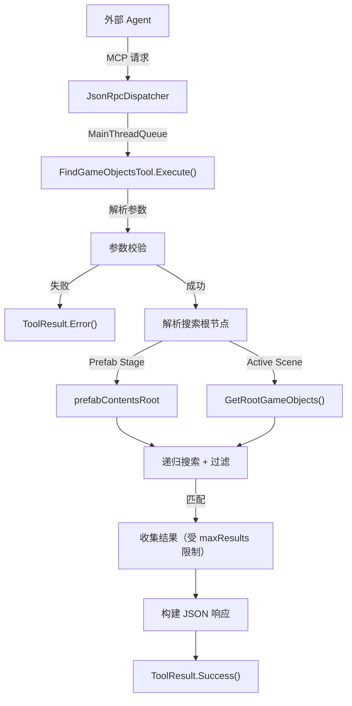

# Design Document: editor_findGameObjects Tool

## Overview

为 Unity MCP Server 新增 `editor_findGameObjects` 工具，在当前场景（或 Prefab Stage）中按名称通配符和/或组件类型搜索 GameObject，返回结构化 JSON 结果。

该工具填补现有工具链的缺口：`editor_getHierarchy` 返回完整场景树，大场景下数据量大且需要 Agent 自行遍历查找；`editor_findGameObjects` 提供服务端过滤，直接返回匹配结果列表，可无缝衔接 `editor_selectGameObject`。

核心设计决策：
- 复用 HierarchyTool 已有的 Prefab Stage / Active Scene 根节点解析逻辑
- 通配符匹配使用手写状态机（`*`/`?`），避免引入 Regex 依赖
- 组件类型匹配使用简短类名（`GetType().Name`），与 HierarchyTool 输出一致
- JSON 输出使用 StringBuilder + MiniJson.SerializeString 手动拼接，与项目现有风格一致
- 当前版本针对中小场景（<5000 GO）设计，大场景的性能优化（如提前终止遍历、索引缓存）留作后续迭代

## Architecture



执行流程：
1. JsonRpcDispatcher 通过 MainThreadQueue 在主线程调用 `Execute()`
2. 解析并校验参数（namePattern / componentType / maxResults）
3. 根据当前编辑上下文确定搜索根节点（Prefab Stage 优先）
4. 递归遍历所有 GameObject，应用名称和组件过滤条件
5. 收集匹配结果直到达到 maxResults 限制（但继续计数 totalFound）
6. 构建 JSON 响应并返回

## Components and Interfaces

### FindGameObjectsTool

实现 `IMcpTool` 接口的搜索工具类。

```
class FindGameObjectsTool : IMcpTool
    Name => "editor_findGameObjects"
    Category => "editor"
    Description => "按名称/组件类型搜索场景中的 GameObject"
    InputSchema => JSON Schema（namePattern, componentType, maxResults）

    Execute(parameters) -> Task<ToolResult>
        1. 解析参数（空字符串视为未提供，等同于 null）
        2. 校验（至少一个搜索条件，maxResults > 0）
        3. 解析根节点
        4. 递归搜索 + 过滤（根据 activeOnly 决定是否跳过 inactive GO）
        5. 构建 JSON 返回
```

### 内部辅助方法

```
internal static WildcardMatch(pattern, text) -> bool
    // 大小写不敏感的通配符匹配
    // * = 零或多个任意字符，? = 恰好一个字符
    // 使用双指针/DP 实现
    // 标记为 internal static 以便属性测试直接验证通配符逻辑

MatchesName(go, namePattern) -> bool
    // 无通配符时视为子串匹配（*pattern*）
    // 有通配符时使用 WildcardMatch

MatchesComponent(go, componentType) -> bool
    // 遍历 go.GetComponents<Component>()
    // 比较 component.GetType().Name，大小写不敏感

GetGameObjectPath(go) -> string
    // 从根到当前节点的绝对路径，如 "/Root/Child/Target"
    // 复用 HierarchyTool 中的同一逻辑

SearchRecursive(transform, namePattern, componentType, activeOnly, results, maxResults, ref totalFound)
    // 递归遍历，检查当前节点是否匹配
    // 若 activeOnly 为 true 且 GO.activeInHierarchy 为 false，跳过该节点及其子树
    // 匹配且 results.Count < maxResults 时加入结果
    // 无论是否加入结果，totalFound 始终递增
    // 继续递归子节点
```

### 与现有组件的关系

- `IMcpTool`: 实现该接口，被 ToolRegistry 自动发现
- `ToolResult`: 使用 `Success()` / `Error()` 构建返回值
- `MiniJson.SerializeString()`: 用于 JSON 字符串转义
- `PrefabStageUtility` / `SceneManager`: 用于解析搜索根节点（与 HierarchyTool 相同）
- `GetGameObjectPath`: 将 HierarchyTool 和 SelectGameObjectTool 中各自实现的 `GetGameObjectPath` 提取为共享的 `internal static` 方法（放在共享辅助类或其中一个工具类中），FindTool 直接复用，避免三处重复实现

## Data Models

### 输入参数

| 参数 | 类型 | 必填 | 默认值 | 说明 |
|------|------|------|--------|------|
| namePattern | string | 否 | - | 名称匹配模式。无通配符时为子串匹配，支持 `*` 和 `?`。空字符串视为未提供 |
| componentType | string | 否 | - | 组件类型简短类名，大小写不敏感。空字符串视为未提供 |
| maxResults | integer | 否 | 50 | 最大返回数量，必须 ≥ 1 |
| activeOnly | boolean | 否 | true | 是否仅搜索激活状态的 GO。true = 仅 activeInHierarchy 为 true 的 GO；false = 搜索所有 GO |

约束：`namePattern` 和 `componentType` 至少提供一个（空字符串等同于未提供）。

### 输出 JSON 结构

成功时返回：
```json
{
  "results": [
    {
      "name": "MainCamera",
      "path": "/Environment/MainCamera",
      "instanceID": 12345,
      "components": ["Transform", "Camera", "AudioListener"]
    }
  ],
  "count": 1,
  "truncated": false,
  "totalFound": 1
}
```

当结果被截断时：
```json
{
  "results": [...],
  "count": 50,
  "truncated": true,
  "totalFound": 128
}
```

无匹配时：
```json
{
  "results": [],
  "count": 0
}
```

### InputSchema（JSON Schema）

```json
{
  "type": "object",
  "properties": {
    "namePattern": {
      "type": "string",
      "description": "名称匹配模式（支持 * 和 ? 通配符，无通配符时为子串匹配）"
    },
    "componentType": {
      "type": "string",
      "description": "组件类型简短类名（如 Camera、MeshRenderer），大小写不敏感"
    },
    "maxResults": {
      "type": "integer",
      "description": "最大返回数量（默认 50）",
      "default": 50
    },
    "activeOnly": {
      "type": "boolean",
      "description": "是否仅搜索激活状态的 GO（默认 true）",
      "default": true
    }
  }
}
```


## Correctness Properties

*A property is a characteristic or behavior that should hold true across all valid executions of a system — essentially, a formal statement about what the system should do. Properties serve as the bridge between human-readable specifications and machine-verifiable correctness guarantees.*

### Property 1: Name filtering — no false positives

*For any* 随机生成的 GameObject 树和任意通配符模式 namePattern，搜索返回的每一个结果的 name 都必须匹配该模式（大小写不敏感）。即：不存在不匹配的结果混入返回列表。

**Validates: Requirements 1.1, 1.2**

### Property 2: Substring fallback equivalence

*For any* 不含 `*` 或 `?` 的字符串 pattern，使用 pattern 搜索的结果集应与使用 `*pattern*` 搜索的结果集完全相同。

**Validates: Requirements 1.3**

### Property 3: Component filtering — no false positives

*For any* 随机生成的 GameObject 树和任意组件类型名称 componentType，搜索返回的每一个结果的 components 列表中都必须包含该类型（大小写不敏感匹配）。

**Validates: Requirements 2.1, 2.2**

### Property 4: Combined search is intersection

*For any* 同时提供 namePattern 和 componentType 的搜索，返回结果集应等于「仅按 namePattern 搜索的结果集」与「仅按 componentType 搜索的结果集」的交集。

**Validates: Requirements 3.1**

### Property 5: Result count respects maxResults and truncation is accurate

*For any* 搜索请求和任意正整数 maxResults，返回的 count 必须 ≤ maxResults。当且仅当实际匹配总数 > maxResults 时，响应中 truncated 为 true 且 totalFound 等于实际匹配总数。

**Validates: Requirements 5.2, 5.4**

### Property 6: Output structure completeness

*For any* 成功的搜索请求，返回 JSON 必须包含 results 数组和 count 字段；results 中的每一项必须包含 name（string）、path（string）、instanceID（int）和 components（string 数组）四个字段。

**Validates: Requirements 1.4, 6.1, 6.2**

### Property 7: Invalid maxResults always rejected

*For any* maxResults 值 < 1（包括 0、负数），工具必须返回错误结果（IsError = true）。

**Validates: Requirements 8.2**

## Error Handling

| 场景 | 行为 | 返回 |
|------|------|------|
| namePattern 和 componentType 均为空/null/空字符串 | 返回错误 | `ToolResult.Error("至少需要提供 namePattern 或 componentType 参数")` |
| maxResults < 1 | 返回错误 | `ToolResult.Error("maxResults 必须为正整数")` |
| 搜索无匹配 | 正常返回空结果 | `ToolResult.Success(...)` with `results: [], count: 0` |
| Component 为 null（Missing Script） | 跳过该 Component | 不影响搜索结果 |

设计决策：
- 无匹配时返回空结果而非错误，因为"没找到"是合法的搜索结果，不是异常状态。这与 HTTP 200 + 空列表的 API 设计惯例一致。
- `namePattern` 和 `componentType` 的空字符串 `""` 视为未提供（等同于 null），与参数校验逻辑保持一致。
- 当前版本针对中小场景（<5000 GO）设计，采用全量递归遍历。大场景的性能优化（如提前终止遍历、分批返回）留作后续迭代。

## Testing Strategy

### 单元测试（NUnit EditMode）

文件：`Tests/Editor/FindGameObjectsToolTests.cs`

覆盖范围：
- 元数据断言：Name = "editor_findGameObjects"、Category = "editor"
- InputSchema 结构验证：包含 namePattern、componentType、maxResults 属性
- ToolRegistry 自动发现：AutoDiscover 后能 Resolve 到该工具
- 参数校验：无参数返回错误、maxResults < 1 返回错误
- 名称搜索：精确子串匹配、通配符匹配、大小写不敏感
- 组件搜索：按类型过滤、大小写不敏感、简短类名匹配
- 组合搜索：AND 语义
- 结果限制：maxResults 截断、truncated 标记、totalFound 计数
- 空结果：返回空数组而非错误
- 递归搜索：深层嵌套的 GO 能被找到

### 属性测试（Property-Based Testing）

文件：`Tests/Editor/FindGameObjectsToolPropertyTests.cs`

框架：手写随机生成（与项目现有模式一致，使用 `System.Random` + 循环 100 次），标记 `[Category("Slow")]`。

每个属性测试对应设计文档中的一个 Correctness Property：
- Property 1: 名称过滤无误报（100 次迭代，随机 GO 树 + 随机通配符模式）
- Property 2: 子串回退等价性（100 次迭代，随机无通配符字符串）
- Property 5: maxResults 上限与截断准确性（100 次迭代，随机 maxResults 值）
- Property 6: 输出结构完整性（100 次迭代，随机搜索条件）
- Property 7: 非法 maxResults 始终拒绝（100 次迭代，随机非正整数）

注：Property 3（组件过滤）和 Property 4（交集语义）因需要在 EditMode 中动态添加/移除 Unity 组件，使用单元测试中的具体示例覆盖更为实际。

### 测试辅助

复用 `HierarchyToolTestHelper`：
- `CreateRandomTree()` — 生成随机 GO 树
- `CleanupGameObjects()` — TearDown 清理
- `GetGameObjectPath()` — 计算 GO 路径

可能需要新增辅助方法：
- `GenerateRandomWildcardPattern(Random)` — 生成随机通配符模式
- `WildcardMatch(pattern, text)` — 独立的通配符匹配函数（可从工具类中提取为 internal static，便于直接测试）
