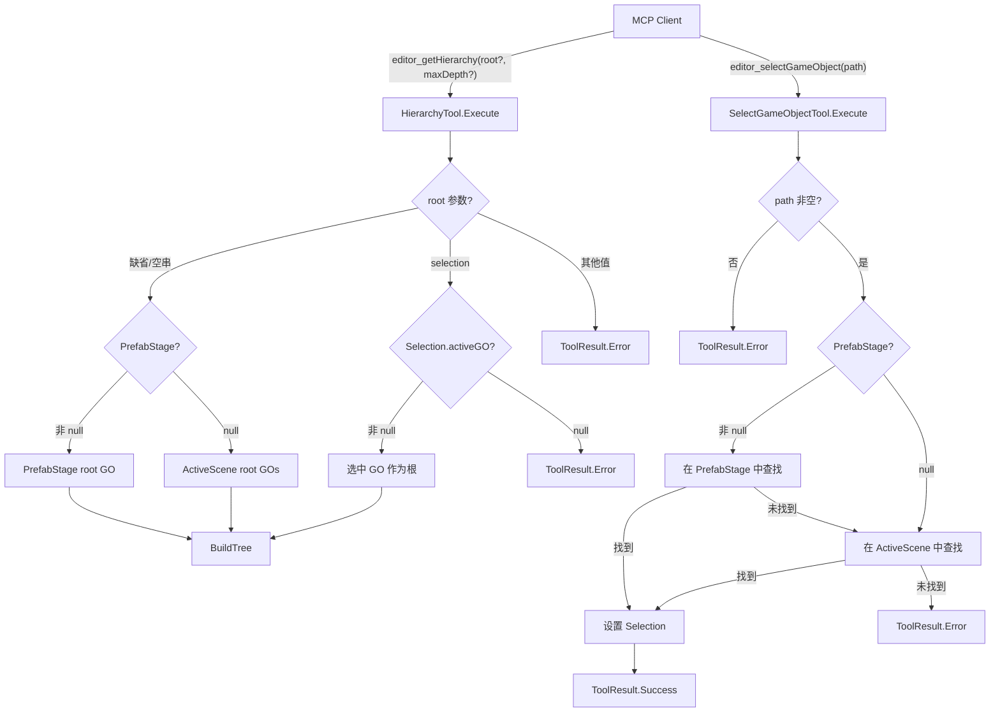

# Design Document: hierarchy-tool-root-param

## Overview

扩展 `HierarchyTool`（`editor_getHierarchy`）增加可选 `root` 参数，并新增 `SelectGameObjectTool`（`editor_selectGameObject`）。

核心变更：
1. `HierarchyTool.Execute` 新增 `root` 参数路由逻辑：缺省/空串 → Prefab Stage 优先，回退 Active Scene；`"selection"` → 以 `Selection.activeGameObject` 为根
2. 新建 `SelectGameObjectTool`，通过路径字符串在 Prefab Stage / Active Scene 中查找并选中 GameObject

设计决策：
- `root` 参数采用白名单枚举（空串 / `"selection"`），而非开放式路径，保持接口简洁；路径定位由专用的 `SelectGameObjectTool` 承担
- Prefab Stage 优先级逻辑在两个工具中保持一致，避免行为不对称
- `BuildTree` 方法保持不变，仅改变传入的根 `GameObject[]`
- `root="selection"` 仅使用 `Selection.activeGameObject`（单选语义）；编辑器中多选 GameObject 时只取 active 对象，其余忽略。Agent 如需查看多个节点可多次调用

## Architecture



## Components and Interfaces

### 1. HierarchyTool（修改）

```
class HierarchyTool : IMcpTool
  Name = "editor_getHierarchy"
  InputSchema 新增 root: string? (enum: ["", "selection"])

  Execute(params):
    maxDepth = 解析 params["maxDepth"]，默认 -1
    root = 解析 params["root"]，默认 null

    if root == null 或 root == "":
      roots = ResolveDefaultRoots()   // Prefab Stage 优先
    else if root == "selection":
      roots = ResolveSelectionRoot()  // 可能返回 error
    else:
      return ToolResult.Error("不支持的 root 值...")

    return BuildTree(roots, maxDepth)

  ResolveDefaultRoots() -> GameObject[]:
    stage = PrefabStageUtility.GetCurrentPrefabStage()
    if stage != null:
      return [stage.prefabContentsRoot]
    else:
      return SceneManager.GetActiveScene().GetRootGameObjects()

  ResolveSelectionRoot() -> GameObject[] 或 ToolResult.Error:
    // 注意：仅使用 Selection.activeGameObject（单选），
    // 多选时只取 active 对象，其余忽略。
    go = Selection.activeGameObject
    if go == null:
      return Error("当前没有选中任何 GameObject")
    return [go]
```

### 2. SelectGameObjectTool（新增）

```
class SelectGameObjectTool : IMcpTool
  Name = "editor_selectGameObject"
  Category = "editor"
  InputSchema: { path: string (required) }

  Execute(params):
    path = params["path"]
    if path 为空:
      return ToolResult.Error("path 参数不能为空")

    go = FindByPath(path)
    if go == null:
      return ToolResult.Error("未找到: {path}")

    Selection.activeGameObject = go
    return ToolResult.Success({name, path, instanceID: go.GetInstanceID()})

  FindByPath(path) -> GameObject?:
    normalizedPath = path.TrimStart('/')
    // 1. 尝试 Prefab Stage
    stage = PrefabStageUtility.GetCurrentPrefabStage()
    if stage != null:
      result = SearchInRoot(stage.prefabContentsRoot, normalizedPath)
      if result != null: return result
    // 2. 回退 Active Scene
    foreach root in ActiveScene.GetRootGameObjects():
      result = SearchInRoot(root, normalizedPath)
      if result != null: return result
    return null

  SearchInRoot(root, path) -> GameObject?:
    segments = path.Split('/')
    if segments[0] != root.name: return null
    current = root.transform
    for i = 1..segments.Length-1:
      child = current.Find(segments[i])
      if child == null: return null
      current = child
    return current.gameObject
```

## Data Models

### 参数模型

| 工具 | 参数 | 类型 | 必填 | 默认值 | 说明 |
|------|------|------|------|--------|------|
| editor_getHierarchy | maxDepth | integer | 否 | -1 | 遍历深度，-1 无限制 |
| editor_getHierarchy | root | string | 否 | (空) | 根节点来源：缺省=自动感知，"selection"=选中对象 |
| editor_selectGameObject | path | string | 是 | — | GameObject 路径，如 "/Root/Child" |

### 输出模型

两个工具的输出格式不变：
- `HierarchyTool` 输出 JSON 数组，每个节点包含 `name`, `active`, `components`, `children`
- `SelectGameObjectTool` 输出 JSON 对象：`{"name":"...", "path":"...", "instanceID": ...}`；错误时返回 `ToolResult.Error`

### InputSchema（HierarchyTool 更新后）

```json
{
  "type": "object",
  "properties": {
    "maxDepth": {
      "type": "integer",
      "description": "最大遍历深度，-1 表示无限制",
      "default": -1
    },
    "root": {
      "type": "string",
      "description": "根节点来源：缺省或空串=Prefab Stage 优先，回退 Active Scene；\"selection\"=以当前选中 GameObject 为根",
      "default": ""
    }
  }
}
```

### InputSchema（SelectGameObjectTool）

```json
{
  "type": "object",
  "properties": {
    "path": {
      "type": "string",
      "description": "要选中的 GameObject 路径（如 \"/Root/Child/Target\"）"
    }
  },
  "required": ["path"]
}
```


## Correctness Properties

*A property is a characteristic or behavior that should hold true across all valid executions of a system — essentially, a formal statement about what the system should do. Properties serve as the bridge between human-readable specifications and machine-verifiable correctness guarantees.*

### Property 1: Selection 模式返回选中节点的子树

*For any* GameObject 树和其中任意一个节点，将该节点设为 `Selection.activeGameObject` 后以 `root="selection"` 调用 HierarchyTool，返回的树应以该节点为根，且包含其所有子节点（受 maxDepth 限制）。

**Validates: Requirements 2.1**

### Property 2: 无效 root 值一律返回错误

*For any* 非空且不等于 `"selection"` 的字符串作为 `root` 参数传入 HierarchyTool，Execute 应返回 `IsError = true` 的 ToolResult。

**Validates: Requirements 3.1**

### Property 3: maxDepth 在所有模式下一致限制树深度

*For any* GameObject 树、任意合法 `root` 模式（缺省 / "selection"）和任意非负 `maxDepth` 值，返回的 JSON 树中任何节点的深度不应超过 `maxDepth`。当 `maxDepth = -1` 时，所有层级均应被遍历。

**Validates: Requirements 4.1, 4.2, 4.3**

### Property 4: 有效路径正确选中目标 GameObject

*For any* 存在于当前场景（或 Prefab Stage）中的 GameObject，以其完整路径调用 SelectGameObjectTool 后，`Selection.activeGameObject` 应指向该 GameObject。

**Validates: Requirements 6.1**

### Property 5: 不存在的路径返回错误

*For any* 不匹配当前场景（或 Prefab Stage）中任何 GameObject 的路径字符串，调用 SelectGameObjectTool 应返回 `IsError = true` 的 ToolResult。

**Validates: Requirements 6.2**

## Error Handling

| 场景 | 返回 | 说明 |
|------|------|------|
| `root` 为不支持的值 | `ToolResult.Error` | 列出支持的值：缺省/空串、"selection" |
| `root="selection"` 但无选中对象 | `ToolResult.Error` | 提示当前没有选中 GameObject |
| SelectGameObjectTool `path` 为空 | `ToolResult.Error` | 提示 path 参数不能为空 |
| SelectGameObjectTool 路径未匹配 | `ToolResult.Error` | 提示路径未找到，包含传入的路径值 |
| `maxDepth` 参数类型异常 | 静默回退 -1 | 与现有行为一致，不中断执行 |

所有错误通过 `ToolResult.Error(message)` 返回，不抛异常，符合 MCP 协议错误响应格式。

## Testing Strategy

### 单元测试（Example-based）

针对具体场景和边界条件：

- **HierarchyTool**
  - 缺省模式（无 Prefab Stage）返回 Active Scene 根对象（已有测试，保持）
  - `root=""` 与缺省行为等价
  - `root="selection"` 无选中对象时返回错误
  - InputSchema 包含 `root` 和 `maxDepth` 属性
- **SelectGameObjectTool**
  - `path` 为空/缺失时返回错误
  - Name = `"editor_selectGameObject"`，Category = `"editor"`
  - InputSchema 包含 required `path` 属性
  - ToolRegistry 自动发现新工具
- **Prefab Stage 相关**（需要 Prefab Stage 环境，可能需标记为集成测试）
  - 缺省模式下 Prefab Stage 优先
  - SelectGameObjectTool 在 Prefab Stage 中优先查找

### 属性测试（Property-based）

使用 NUnit + FsCheck（或手动随机生成）实现，每个属性至少 100 次迭代，标记 `[Category("Slow")]`：

1. **Property 1**: 生成随机 GameObject 树，随机选中一个节点，验证 `root="selection"` 返回的树以该节点为根
   - Tag: `Feature: hierarchy-tool-root-param, Property 1: Selection 模式返回选中节点的子树`

2. **Property 2**: 生成随机字符串（排除 "" 和 "selection"），验证均返回 IsError
   - Tag: `Feature: hierarchy-tool-root-param, Property 2: 无效 root 值一律返回错误`

3. **Property 3**: 生成随机树 + 随机 maxDepth (0..10)，在缺省和 selection 模式下验证输出树深度不超过 maxDepth
   - Tag: `Feature: hierarchy-tool-root-param, Property 3: maxDepth 在所有模式下一致限制树深度`

4. **Property 4**: 生成随机 GameObject 树，随机选一个节点计算其路径，调用 SelectGameObjectTool，验证 Selection.activeGameObject 指向该节点
   - Tag: `Feature: hierarchy-tool-root-param, Property 4: 有效路径正确选中目标 GameObject`

5. **Property 5**: 生成随机路径字符串（不匹配任何现有 GO），验证返回 IsError
   - Tag: `Feature: hierarchy-tool-root-param, Property 5: 不存在的路径返回错误`

### 测试辅助

新建 `Tests/Editor/HierarchyToolTestHelper.cs`：
- `CreateRandomTree(maxDepth, maxChildren)` — 生成随机 GameObject 树，返回根节点和所有节点列表
- `GetGameObjectPath(go)` — 计算 GameObject 的完整路径
- `MeasureJsonTreeDepth(json)` — 解析 JSON 输出，返回最大嵌套深度
- `CleanupGameObjects(list)` — TearDown 时销毁所有测试 GO
