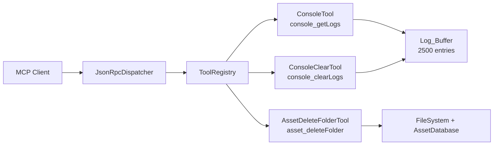

# Design Document: mcp-console-asset-tools

## Overview

本设计为 Unity MCP Server 新增两个工具（`asset_deleteFolder`、`console_clearLogs`），并增强现有 `console_getLogs` 工具（级别过滤、关键字搜索、上下文模式），同时将日志缓冲区容量从 1000 扩容到 2500。

所有改动遵循现有 `IMcpTool` 接口模式，新工具由 `ToolRegistry` 自动发现，无需手动注册。

### 不在本次范围内

- `asset_deleteFolder` 仅支持删除目录，不支持删除单个文件
- `keyword` 过滤为大小写不敏感的子串匹配，不支持正则表达式
- 不修改现有 `ConsoleTool` 的 Category（保持 `"debug"`）
- 不改动日志缓冲区的数据结构（`List<T>`），仅扩容

## Architecture

整体架构不变。新增/修改的组件均位于 `Editor/Tools/` 目录下，遵循现有的 Tool 层模式：



关键约束：
- 所有 `IMcpTool.Execute` 调用已由 `JsonRpcDispatcher` 通过 `MainThreadQueue` 在主线程执行，工具实现内部无需再做线程调度
- `console_clearLogs` 需要访问 `ConsoleTool` 的静态缓冲区，复用已有的 `ClearBuffer()` 内部方法
- 日志缓冲区为 `ConsoleTool` 内部的静态 `List<LogEntry>`，受 `_lock` 保护，线程安全
- 当前缓冲区使用 `List<T>.RemoveAt(0)` 实现 FIFO 淘汰，扩容到 2500 后 O(n) 开销增大，后续可考虑改用 `LinkedList<T>` 或 circular buffer。本次不改动数据结构

## Components and Interfaces

### 1. AssetDeleteFolderTool（新增）

文件：`Editor/Tools/AssetDeleteFolderTool.cs`

```
class AssetDeleteFolderTool : IMcpTool
  Name = "asset_deleteFolder"
  Category = "editor"
  InputSchema: { path: string (required) }

  Execute(params):
    1. 提取 path 参数，为空则返回 Error("path parameter is required")
    2. 路径安全校验：将 path 规范化（解析 ".."、symlink），验证其解析后仍在 Assets 目录下
       - 不在 Assets 下 → Error("path is outside Assets folder")
    3. 检查目录是否存在
       - 不存在 → Error("directory not found: {path}")
    4. 直接执行（Execute 已在主线程）：
       a. Directory.Delete(fullPath, recursive: true)
       b. AssetDatabase.Refresh()
    5. 返回 Success("Deleted: {path}")
```

路径安全校验伪码：
```
ValidatePath(path):
  // path 为相对于项目根目录的路径，如 "Assets/XLua/Gen"
  projectRoot = Path.GetDirectoryName(Application.dataPath)  // e.g. /project
  fullPath = Path.GetFullPath(Path.Combine(projectRoot, path))
  // GetFullPath 会解析 ".." 等相对路径；在 macOS/Linux 上还需注意 symlink
  if !fullPath.StartsWith(Application.dataPath) → reject  // 必须落在 Assets 目录下
  return fullPath
```

### 2. ConsoleClearTool（新增）

文件：`Editor/Tools/ConsoleClearTool.cs`

```
class ConsoleClearTool : IMcpTool
  Name = "console_clearLogs"
  Category = "debug"
  InputSchema: {} (无参数)

  Execute(params):
    1. 调用 ConsoleTool.ClearBuffer()
    2. 返回 Success("Log buffer cleared.")
```

需要将 `ConsoleTool.ClearBuffer()` 的访问级别从 `internal` 保持不变（同一程序集内可访问）。

### 3. ConsoleTool 增强（修改）

文件：`Editor/Tools/ConsoleTool.cs`

修改点：

**a) MaxBufferSize: 1000 → 2500**

**b) InputSchema 更新**，新增参数：
- `level`: string, optional — "Error" / "Warning" / "Log"
- `keyword`: string, optional — 大小写不敏感子串匹配
- `beforeIndex`: integer, optional — 上下文模式锚点索引

**c) Execute 逻辑分支**：

```
Execute(params):
  解析参数: count (default 20), level, keyword, beforeIndex

  IF beforeIndex 已提供:
    → 进入上下文模式（忽略 level 和 keyword）
    验证 beforeIndex: < 0 → Error; >= buffer.Count → Error
    计算切片: start = max(0, beforeIndex - count + 1), end = beforeIndex (inclusive)
    返回 buffer[start..end]（每条包含 index 字段）

  ELSE:
    → 进入过滤模式
    IF level 已提供且不是有效值 → Error
    从 buffer 尾部向前扫描:
      对每条 entry 检查:
        - level 匹配（如果指定）
        - keyword 包含（如果指定，case-insensitive）
      匹配则加入结果，直到收集 count 条或扫描完毕
    按时间顺序返回结果（每条包含 index 字段）
```

**d) 返回 JSON 格式**：每条日志在返回时均包含 `index` 字段（全局递增的稳定 ID，写入时由 `_nextIndex++` 分配），使调用方可直接用于后续 `beforeIndex` 查询，不受缓冲区淘汰影响：
```json
{ "level": "Error", "timestamp": "...", "message": "...", "index": 42 }
```

### 4. 共享缓冲区访问

`ConsoleClearTool` 需要清空 `ConsoleTool` 的缓冲区。当前 `ClearBuffer()` 已是 `internal static`，同一程序集内可直接调用，无需额外暴露。

## Data Models

### LogEntry（增强）

```
struct LogEntry
  Index: long       // 全局递增稳定 ID，写入时分配
  Level: string     // "Error" | "Warning" | "Log"
  Timestamp: string // ISO 8601 UTC
  Message: string
```

> `index` 字段在日志写入缓冲区时由 `_nextIndex++` 分配，是全局递增的稳定 ID。即使旧日志被淘汰，已分配的 index 值不会改变。调用方可从 `getLogs` 结果中获取 `index` 用于后续 `beforeIndex` 查询。`beforeIndex` 查找通过 `globalIndex - _buffer[0].Index` 做 O(1) 偏移计算。

### console_getLogs 参数模型（增强后）

```json
{
  "type": "object",
  "properties": {
    "count": { "type": "integer", "description": "日志条数", "default": 20 },
    "level": { "type": "string", "description": "日志级别过滤", "enum": ["Error", "Warning", "Log"] },
    "keyword": { "type": "string", "description": "关键字过滤（大小写不敏感）" },
    "beforeIndex": { "type": "integer", "description": "上下文模式：锚点索引（稳定全局 ID）" }
  }
}
```

### asset_deleteFolder 参数模型

```json
{
  "type": "object",
  "properties": {
    "path": { "type": "string", "description": "要删除的目录路径（相对于项目根目录，如 Assets/XLua/Gen）" }
  },
  "required": ["path"]
}
```

### console_clearLogs 参数模型

```json
{
  "type": "object",
  "properties": {}
}
```

## Correctness Properties

*A property is a characteristic or behavior that should hold true across all valid executions of a system — essentially, a formal statement about what the system should do. Properties serve as the bridge between human-readable specifications and machine-verifiable correctness guarantees.*

### Property 1: Path safety validation

*For any* string path that, after normalization (resolving `..`, absolute paths, symlinks pointing outside Assets, etc.), does not resolve to a location under the Unity project's Assets directory, the `asset_deleteFolder` tool SHALL reject the path and return an error without performing any file system deletion.

**Validates: Requirements 1.3**

### Property 2: Combined log filtering invariant

*For any* log buffer containing arbitrary log entries, and *for any* combination of optional `level` filter (valid value or absent), optional `keyword` filter (any string or absent), and `count` limit (any positive integer), the result of `console_getLogs` SHALL satisfy all of the following simultaneously:
- result length ≤ count
- if level is specified, every returned entry's Level equals the specified level
- if keyword is specified, every returned entry's Message contains the keyword (case-insensitive)

**Validates: Requirements 3.1, 3.4, 4.1, 4.3**

### Property 3: Context mode returns correct contiguous slice

*For any* log buffer of size N, *for any* valid anchor index `beforeIndex` (0 ≤ beforeIndex < N), and *for any* positive `count`, the result of `console_getLogs` in context mode SHALL be the contiguous sub-sequence `buffer[max(0, beforeIndex - count + 1) .. beforeIndex]` (inclusive), ordered chronologically, regardless of any `level` or `keyword` parameters provided.

**Validates: Requirements 5.1, 5.2, 5.5, 5.6**

### Property 4: Buffer capacity invariant with FIFO eviction

*For any* sequence of N log entries inserted into the buffer where N > 2500, the buffer size SHALL remain exactly 2500, and the buffer SHALL contain only the most recent 2500 entries in insertion order (i.e., the oldest N − 2500 entries are evicted).

**Validates: Requirements 6.1, 6.2**

## Error Handling

| 场景 | 工具 | 返回 |
|---|---|---|
| path 为空/缺失 | asset_deleteFolder | `Error("path parameter is required")` |
| path 在 Assets 外 | asset_deleteFolder | `Error("path is outside the Assets folder: {path}")` |
| 目录不存在 | asset_deleteFolder | `Error("directory not found: {path}")` |
| Directory.Delete 抛异常 | asset_deleteFolder | `Error("failed to delete: {exception.Message}")` |
| level 值无效 | console_getLogs | `Error("invalid level: {value}. Valid values: Error, Warning, Log")` |
| beforeIndex < 0 | console_getLogs | `Error("beforeIndex must be non-negative")` |
| beforeIndex ≥ buffer.Count | console_getLogs | `Error("beforeIndex out of range: {value}, buffer size: {size}")` |

所有错误通过 `ToolResult.Error(message)` 返回，不抛出异常。文件系统操作（delete）用 try-catch 包裹，异常转为 Error 结果。

## Testing Strategy

测试框架：NUnit（Unity Test Runner EditMode），与现有测试保持一致。

### 单元测试

| 测试目标 | 策略 |
|---|---|
| AssetDeleteFolderTool — Name/Category | 实例化断言属性值 |
| AssetDeleteFolderTool — 空路径 | 传空参数，断言 Error |
| AssetDeleteFolderTool — 路径不存在 | 传不存在路径，断言 Error |
| AssetDeleteFolderTool — 路径安全（越界） | 传 `../../etc` 等路径，断言 Error |
| AssetDeleteFolderTool — 自动发现 | AutoDiscover 后断言 tool 列表包含 "asset_deleteFolder" |
| ConsoleClearTool — Name/Category | 实例化断言属性值 |
| ConsoleClearTool — 清空非空缓冲区 | 注入日志 → 执行 → 断言 BufferCount == 0 |
| ConsoleClearTool — 清空空缓冲区 | 直接执行 → 断言 Success |
| ConsoleClearTool — 自动发现 | AutoDiscover 后断言 tool 列表包含 "console_clearLogs" |
| ConsoleTool — 无 level 参数返回全部级别 | 注入混合级别日志，不传 level，断言结果包含所有级别 |
| ConsoleTool — 无效 level 返回错误 | 传 level="Debug"，断言 Error |
| ConsoleTool — beforeIndex 越界 | 传超出范围的 index，断言 Error |
| ConsoleTool — beforeIndex 负数 | 传 -1，断言 Error |
| ConsoleTool — 上下文模式忽略 level/keyword | 传 beforeIndex + level，断言返回未过滤的上下文 |

### 属性测试

使用 NUnit 的 `[TestCase]` 结合手动随机数据生成模拟属性测试（Unity 环境无 FsCheck/Hypothesis，但可通过循环 100+ 次随机输入实现等效效果）。所有属性测试标注 `[Category("Slow")]`，日常 CI 可通过 `--where "cat != Slow"` 选择性跳过。

| Property | 测试方法 | 最少迭代 |
|---|---|---|
| Property 1: Path safety | 生成随机路径字符串（含 `..`、绝对路径、特殊字符、symlink 指向外部目录的场景），验证非 Assets 路径全部被拒绝 | 100 |
| Property 2: Combined filtering | 生成随机 buffer（随机级别、随机消息）+ 随机 level/keyword/count 组合，验证返回结果满足所有约束 | 100 |
| Property 3: Context mode slice | 生成随机 buffer + 随机 beforeIndex + 随机 count，验证返回的切片与预期一致 | 100 |
| Property 4: Buffer capacity | 注入随机数量（2501–5000）条日志，验证 buffer 大小 == 2500 且包含最新的 2500 条 | 100 |

每个属性测试需在注释中标注：
```
// Feature: mcp-console-asset-tools, Property {N}: {property_text}
```
