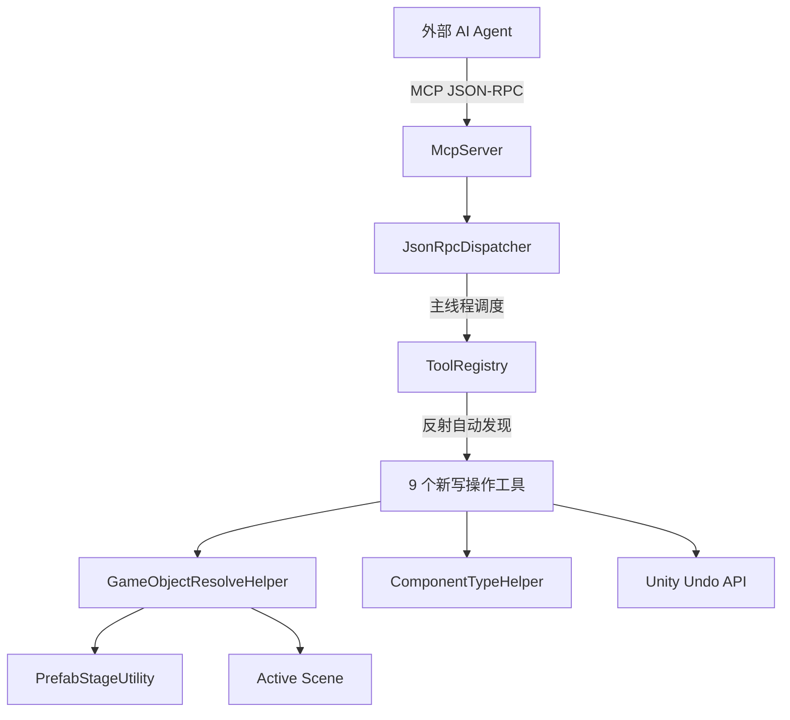
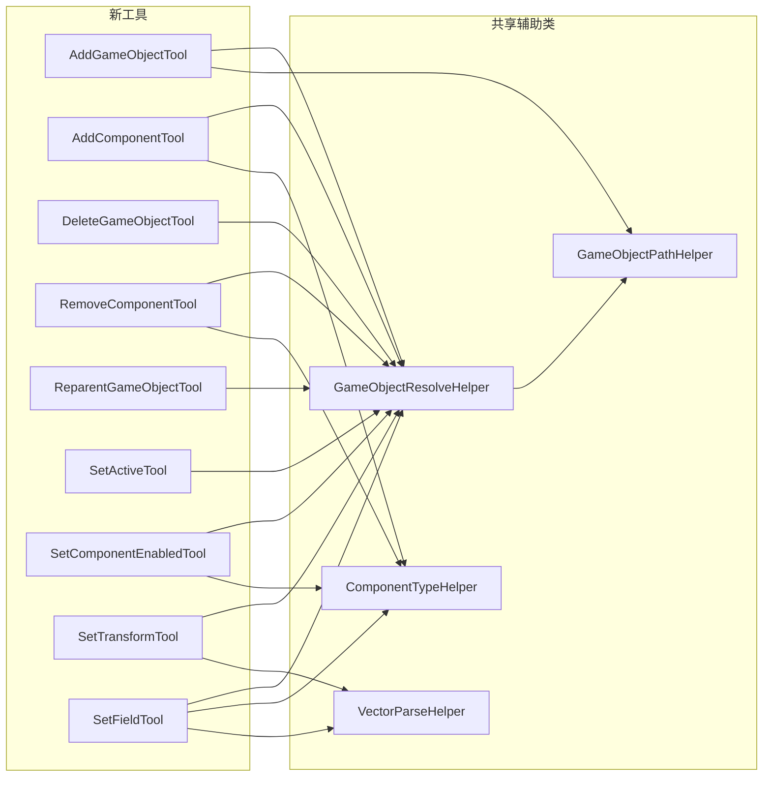

# Design Document

## Overview

本设计为 Unity MCP Server 新增 9 个"写与改"类场景操作工具，补全当前仅有"读与查"类工具的能力缺口。所有新工具遵循现有架构：实现 `IMcpTool` 接口、由 `ToolRegistry` 反射自动发现、使用 `StringBuilder` + `MiniJson.SerializeString()` 手动构建 JSON 响应。

本次会小幅重构 `SelectGameObjectTool` 的内部实现（行为不变），将其 `FindByPath` / `SearchInRoot` 逻辑提取到新的 `GameObjectResolveHelper` 中，使新旧工具共享同一套路径查找代码。

核心设计决策：
- 抽取共享的 GO 定位逻辑为 `GameObjectResolveHelper`，避免 9 个工具重复实现 instanceID/path 双模式解析 + Prefab Stage 优先回退
- 抽取共享的组件类型查找逻辑为 `ComponentTypeHelper`，统一处理大小写不敏感的简短类名匹配
- 抽取共享的向量/颜色解析逻辑为 `VectorParseHelper`，`SetTransformTool` 和 `SetFieldTool` 共用
- 所有写操作通过 Unity `Undo` API 记录，确保用户可在 Editor 中撤销
- 空字符串统一视为 null（未提供），所有 string 参数入口处做 `string.IsNullOrEmpty` 检查

### Out of Scope

- 批量操作（一次调用操作多个 GO/组件）
- Prefab Override 管理与 Prefab Asset 保存
- AssetDatabase 操作（如创建/修改 Prefab Asset、材质等资源文件）
- 运行时（PlayMode）场景修改

## Architecture

### 整体架构

新工具完全融入现有架构，不修改任何核心代码：



### 工具与共享辅助类关系



### 设计决策

1. **共享 Helper 而非基类继承**：使用静态辅助类（`GameObjectResolveHelper`、`ComponentTypeHelper`）而非抽象基类。原因：现有工具均为独立类直接实现 `IMcpTool`，引入基类会破坏一致性，且静态方法更简单直接。

2. **GameObjectResolveHelper 独立于 GameObjectPathHelper**：`GameObjectPathHelper` 仅负责路径计算（已有），`GameObjectResolveHelper` 负责 instanceID/path 双模式解析 + Prefab Stage 优先回退。职责分离，避免膨胀已有类。

3. **ComponentTypeHelper 集中组件类型查找**：多个工具需要按简短类名（大小写不敏感）查找组件类型或组件实例，抽取为共享方法避免重复。

4. **AddGameObjectTool 的父节点定位**：使用独立的 `parentInstanceID` / `parentPath` 参数名（而非复用 `instanceID` / `path`），因为该工具的主体操作是"创建"而非"定位已有 GO"，语义更清晰。

5. **向量参数使用数组格式**：`[1, 2, 3]` 表示 Vector3，`[0.5, 0.5]` 表示 Vector2。MiniJson 将其解析为 `List<object>`，工具内部转换为 Unity 向量类型。

6. **FindByPath 提取到 GameObjectResolveHelper**：将 `SelectGameObjectTool` 中已有的 `FindByPath` 和 `SearchInRoot` 方法提取到 `GameObjectResolveHelper`，然后让 `SelectGameObjectTool` 调用 Helper。这是一次行为不变的小幅重构，消除路径查找逻辑的重复。

## Components and Interfaces

### 1. GameObjectResolveHelper（新增共享辅助类）

位置：`Editor/Tools/GameObjectResolveHelper.cs`
命名空间：`UnityMcp.Editor.Tools`

```
internal static class GameObjectResolveHelper
    // 从参数字典中解析 instanceID 和 path，定位 GameObject
    // 返回 (GameObject go, string errorMessage)
    // go != null 表示成功，errorMessage != null 表示失败
    static (GameObject, string) Resolve(Dictionary<string, object> parameters)
    
    // 从参数字典中按指定 key 名解析定位（用于 AddGO 的 parentInstanceID/parentPath）
    static (GameObject, string) Resolve(
        Dictionary<string, object> parameters,
        string instanceIDKey,
        string pathKey)
    
    // 核心路径查找：Prefab Stage 优先，回退 Active Scene
    // 从 SelectGameObjectTool 提取而来，SelectGameObjectTool 重构后调用此方法
    static GameObject FindByPath(string path)
    
    // 在指定根节点下按路径段逐级查找（从 SelectGameObjectTool.SearchInRoot 提取）
    static GameObject SearchInRoot(GameObject root, string normalizedPath)
```

关键行为：
- `instanceID` 优先于 `path`
- 空字符串视为未提供
- Prefab Stage 优先查找，回退 Active Scene
- 两个参数都未提供时返回错误信息

### 2. ComponentTypeHelper（新增共享辅助类）

位置：`Editor/Tools/ComponentTypeHelper.cs`
命名空间：`UnityMcp.Editor.Tools`

```
internal static class ComponentTypeHelper
    // 通过简短类名查找 System.Type（大小写不敏感）
    // 扫描所有已加载程序集中继承自 Component 的类型
    static Type FindType(string shortName)
    
    // 在 GO 上查找第一个匹配指定类型名的组件（大小写不敏感）
    static Component FindComponent(GameObject go, string typeName)
```

关键行为：
- 大小写不敏感匹配
- `FindType` 遍历 `AppDomain.CurrentDomain.GetAssemblies()` 查找
- `FindComponent` 遍历 `go.GetComponents<Component>()` 按类名匹配
- 首个版本不做缓存；如果性能分析表明 `AppDomain.GetAssemblies()` 遍历成为瓶颈，后续可增加 `Dictionary<string, Type>` 缓存（Domain Reload 时通过 `[InitializeOnLoadMethod]` 清空）

### 3. 九个新工具

所有工具位于 `Editor/Tools/` 目录，命名空间 `UnityMcp.Editor.Tools`，实现 `IMcpTool` 接口。

| 工具类名 | Name | 主要参数 | Undo API |
|---------|------|---------|----------|
| AddGameObjectTool | editor_addGameObject | name?, parentInstanceID?, parentPath? | Undo.RegisterCreatedObjectUndo |
| AddComponentTool | editor_addComponent | instanceID/path, componentType | Undo.AddComponent (自动) |
| DeleteGameObjectTool | editor_deleteGameObject | instanceID/path | Undo.DestroyObjectImmediate |
| RemoveComponentTool | editor_removeComponent | instanceID/path, componentType | Undo.DestroyObjectImmediate |
| ReparentGameObjectTool | editor_reparentGameObject | instanceID/path, newParentInstanceID/newParentPath, worldPositionStays? | Undo.SetTransformParent |
| SetActiveTool | editor_setActive | instanceID/path, active | Undo.RecordObject |
| SetComponentEnabledTool | editor_setComponentEnabled | instanceID/path, componentType, enabled | Undo.RecordObject |
| SetTransformTool | editor_setTransform | instanceID/path, localPosition?, localRotation?, localScale?, anchoredPosition?, sizeDelta?, pivot?, anchorMin?, anchorMax? | Undo.RecordObject |
| SetFieldTool | editor_setField | instanceID/path, componentType, fieldName, value | SerializedObject.ApplyModifiedProperties |

### 4. 各工具 Execute 流程伪代码

#### AddGameObjectTool

```
Execute(params):
    name = params["name"] ?? "GameObject"
    (parent, err) = ResolveHelper.Resolve(params, "parentInstanceID", "parentPath")
    if 提供了父节点参数但 parent == null: return Error(err)
    
    if 未提供父节点参数:
        if 处于 PrefabStage:
            parent = prefabStage.prefabContentsRoot
        else:
            parent = null  // 场景根级
    
    go = new GameObject(name)
    Undo.RegisterCreatedObjectUndo(go, "Add GameObject")
    if parent != null:
        go.transform.SetParent(parent.transform, false)
    
    return Success({ name, path, instanceID })
```

#### AddComponentTool

```
Execute(params):
    (go, err) = ResolveHelper.Resolve(params)
    if go == null: return Error(err)
    
    typeName = params["componentType"]
    if empty: return Error("componentType 为必填参数")
    
    type = ComponentTypeHelper.FindType(typeName)
    if type == null: return Error("未找到组件类型: ...")
    
    comp = Undo.AddComponent(go, type)  // 自动支持 Undo
    return Success({ componentType, name, path, instanceID })
```

#### DeleteGameObjectTool

```
Execute(params):
    (go, err) = ResolveHelper.Resolve(params)
    if go == null: return Error(err)
    
    name = go.name
    path = GameObjectPathHelper.GetGameObjectPath(go)
    Undo.DestroyObjectImmediate(go)
    
    return Success({ name, path })
```

#### RemoveComponentTool

```
Execute(params):
    (go, err) = ResolveHelper.Resolve(params)
    if go == null: return Error(err)
    
    typeName = params["componentType"]
    if empty: return Error(...)
    
    comp = ComponentTypeHelper.FindComponent(go, typeName)
    if comp == null: return Error("未找到组件: ...")
    
    if comp is Transform or RectTransform:
        return Error("Transform 组件不可移除")
    
    Undo.DestroyObjectImmediate(comp)
    return Success({ componentType, name, path })
```

#### ReparentGameObjectTool

```
Execute(params):
    (go, err) = ResolveHelper.Resolve(params)
    if go == null: return Error(err)
    
    worldPositionStays = params["worldPositionStays"] ?? true
    
    // 解析新父节点
    newParentProvided = 参数中包含 newParentInstanceID 或 newParentPath
    if newParentProvided 且值非空:
        (newParent, err) = ResolveHelper.Resolve(params, "newParentInstanceID", "newParentPath")
        if newParent == null: return Error(err)
    else:
        // 移到根级
        if 处于 PrefabStage:
            newParent = prefabStage.prefabContentsRoot.transform
        else:
            newParent = null
    
    Undo.SetTransformParent(go.transform, newParent, worldPositionStays, "Reparent")
    return Success({ name, path(新), instanceID })
```

#### SetActiveTool

```
Execute(params):
    (go, err) = ResolveHelper.Resolve(params)
    if go == null: return Error(err)
    
    active = params["active"]
    if 未提供: return Error("active 为必填参数")
    
    Undo.RecordObject(go, "Set Active")
    go.SetActive(active)
    
    return Success({ name, path, activeSelf })
```

#### SetComponentEnabledTool

```
Execute(params):
    (go, err) = ResolveHelper.Resolve(params)
    if go == null: return Error(err)
    
    comp = ComponentTypeHelper.FindComponent(go, params["componentType"])
    if comp == null: return Error(...)
    
    if comp is Behaviour b:
        Undo.RecordObject(b, "Set Enabled")
        b.enabled = params["enabled"]
    else if comp is Renderer r:
        Undo.RecordObject(r, "Set Enabled")
        r.enabled = params["enabled"]
    else:
        return Error("该组件不支持启停操作")
    
    return Success({ componentType, name, path, enabled })
```

#### SetTransformTool

```
Execute(params):
    (go, err) = ResolveHelper.Resolve(params)
    if go == null: return Error(err)
    
    hasAnyProp = false
    transform = go.transform
    Undo.RecordObject(transform, "Set Transform")
    
    if params has "localPosition":
        transform.localPosition = ParseVector3(params["localPosition"])
        hasAnyProp = true
    if params has "localRotation":
        transform.localEulerAngles = ParseVector3(params["localRotation"])
        hasAnyProp = true
    if params has "localScale":
        transform.localScale = ParseVector3(params["localScale"])
        hasAnyProp = true
    
    if transform is RectTransform rt:
        // 解析 anchoredPosition, sizeDelta, pivot, anchorMin, anchorMax
        ...
    else if params 中包含任何 RectTransform 专属参数:
        return Error("目标 GO 不含 RectTransform 组件，无法设置 anchoredPosition/sizeDelta 等属性")
    
    if !hasAnyProp: return Error("至少需要提供一个属性参数")
    
    return Success({ name, path, 各属性当前值 })
```

#### SetFieldTool

```
Execute(params):
    (go, err) = ResolveHelper.Resolve(params)
    if go == null: return Error(err)
    
    comp = ComponentTypeHelper.FindComponent(go, params["componentType"])
    if comp == null: return Error(...)
    
    so = new SerializedObject(comp)
    prop = so.FindProperty(params["fieldName"])
    if prop == null: return Error("未找到序列化字段: ...")
    
    SetPropertyValue(prop, params["value"])  // 按 propertyType 分发
    so.ApplyModifiedProperties()  // 自动支持 Undo
    
    return Success({ fieldName, fieldType, newValue })
```

##### SetPropertyValue 分发伪代码

```
SetPropertyValue(prop, value):
    switch prop.propertyType:
        case Integer:   prop.intValue = (int)value
        case Boolean:   prop.boolValue = (bool)value
        case Float:     prop.floatValue = ToFloat(value)
        case String:    prop.stringValue = (string)value
        
        case Enum:
            if value is string enumName:
                // 按名称查找 → 设置 enumValueIndex
                idx = Array.IndexOf(prop.enumDisplayNames, enumName)  // 大小写敏感
                if idx < 0: return Error("枚举值未找到: {enumName}")
                prop.enumValueIndex = idx
            else:
                prop.enumValueIndex = (int)value  // 按索引
        
        case Vector2:   prop.vector2Value = VectorParseHelper.ParseVector2(value)
        case Vector3:   prop.vector3Value = VectorParseHelper.ParseVector3(value)
        case Vector4:   prop.vector4Value = VectorParseHelper.ParseVector4(value)
        
        case Color:
            // value 为 [r, g, b, a] 数组，各分量 0~1 float
            prop.colorValue = VectorParseHelper.ParseColor(value)
        
        case Rect:
            // value 为 [x, y, width, height] 数组
            prop.rectValue = VectorParseHelper.ParseRect(value)
        
        case ObjectReference:
            // value 为 instanceID (integer)
            obj = EditorUtility.InstanceIDToObject((int)value)
            prop.objectReferenceValue = obj  // null 也合法（清除引用）
        
        default:
            return Error("不支持的字段类型: {prop.propertyType}")
```

### 5. VectorParseHelper（新增共享辅助类）

位置：`Editor/Tools/VectorParseHelper.cs`
命名空间：`UnityMcp.Editor.Tools`

`SetTransformTool` 和 `SetFieldTool` 共用的向量/颜色/矩形解析方法，避免各自实现一套。

```
internal static class VectorParseHelper
    // raw 为 List<object>（MiniJson 解析结果），取前 N 个元素转 float
    static Vector2 ParseVector2(object raw)
    static Vector3 ParseVector3(object raw)
    static Vector4 ParseVector4(object raw)
    
    // [r, g, b, a] → Color，各分量 0~1
    static Color ParseColor(object raw)
    
    // [x, y, width, height] → Rect
    static Rect ParseRect(object raw)
    
    // 内部辅助：将 object (long/double/int) 转为 float
    static float ToFloat(object raw)
```

所有方法在数组长度不足或元素类型无法转换时抛出 `ArgumentException`，由调用方的 try-catch 统一处理。

## Data Models

### 参数模型

所有参数通过 `Dictionary<string, object>` 传入（MiniJson 反序列化结果），各工具自行提取和校验。

#### 通用 GO 定位参数

| 参数名 | 类型 | 说明 |
|-------|------|------|
| instanceID | integer (long) | GO 的 instanceID，优先使用 |
| path | string | GO 的层级路径，如 "/Root/Child" |

#### AddGameObjectTool 参数

| 参数名 | 类型 | 必填 | 默认值 | 说明 |
|-------|------|------|-------|------|
| name | string | 否 | "GameObject" | 新 GO 名称 |
| parentInstanceID | integer | 否 | - | 父节点 instanceID |
| parentPath | string | 否 | - | 父节点路径 |

#### AddComponentTool 参数

| 参数名 | 类型 | 必填 | 说明 |
|-------|------|------|------|
| instanceID/path | - | 是(二选一) | 目标 GO |
| componentType | string | 是 | 组件简短类名 |

#### ReparentGameObjectTool 参数

| 参数名 | 类型 | 必填 | 默认值 | 说明 |
|-------|------|------|-------|------|
| instanceID/path | - | 是(二选一) | - | 目标 GO |
| newParentInstanceID | integer | 否 | - | 新父节点 instanceID |
| newParentPath | string | 否 | - | 新父节点路径 |
| worldPositionStays | boolean | 否 | true | 是否保持世界坐标 |

#### SetTransformTool 参数

| 参数名 | 类型 | 必填 | 说明 |
|-------|------|------|------|
| instanceID/path | - | 是(二选一) | 目标 GO |
| localPosition | array[3] | 否 | [x, y, z] |
| localRotation | array[3] | 否 | [x, y, z] 欧拉角 |
| localScale | array[3] | 否 | [x, y, z] |
| anchoredPosition | array[2] | 否 | [x, y]（仅 RectTransform） |
| sizeDelta | array[2] | 否 | [w, h]（仅 RectTransform） |
| pivot | array[2] | 否 | [x, y]（仅 RectTransform） |
| anchorMin | array[2] | 否 | [x, y]（仅 RectTransform） |
| anchorMax | array[2] | 否 | [x, y]（仅 RectTransform） |

#### SetFieldTool 参数

| 参数名 | 类型 | 必填 | 说明 |
|-------|------|------|------|
| instanceID/path | - | 是(二选一) | 目标 GO |
| componentType | string | 是 | 组件简短类名 |
| fieldName | string | 是 | 序列化字段名 |
| value | any | 是 | 新值（类型需与字段匹配） |

### 返回模型

所有工具返回 `ToolResult`，成功时 Content 为手动构建的 JSON 字符串。

#### 通用成功返回字段

| 字段 | 类型 | 说明 |
|------|------|------|
| name | string | GO 名称 |
| path | string | GO 层级路径 |
| instanceID | integer | GO instanceID |

#### SetFieldTool 成功返回

| 字段 | 类型 | 说明 |
|------|------|------|
| fieldName | string | 字段名 |
| fieldType | string | SerializedPropertyType 名称 |
| newValue | string | 修改后的值（字符串表示） |


## Correctness Properties

*A property is a characteristic or behavior that should hold true across all valid executions of a system — essentially, a formal statement about what the system should do. Properties serve as the bridge between human-readable specifications and machine-verifiable correctness guarantees.*

### Property 1: 组件类型名大小写不敏感匹配

*For any* 已知的 Unity 组件类型名和该类型名的任意大小写变体，`ComponentTypeHelper.FindType` 应返回相同的 Type 对象。

**Validates: Requirements 2.2, 4.2, 7.2, 9.10**

### Property 2: 创建 GO 返回值与实际一致

*For any* 有效的名称字符串，调用 AddGameObjectTool 创建 GO 后，返回 JSON 中的 `name`、`path`、`instanceID` 应与场景中实际创建的 GO 属性一致。

**Validates: Requirements 1.1, 1.6**

### Property 3: 创建 GO 的父子关系正确

*For any* 已存在的父节点 GO，调用 AddGameObjectTool 指定该父节点后，新创建的 GO 的 `transform.parent` 应指向该父节点的 Transform。

**Validates: Requirements 1.2**

### Property 4: 删除 GO 及所有子对象

*For any* 具有任意深度子层级的 GO，调用 DeleteGameObjectTool 后，该 GO 及其所有后代节点都应被销毁（引用变为 null）。

**Validates: Requirements 3.1**

### Property 5: Transform 组件不可移除

*For any* GO，调用 RemoveComponentTool 尝试移除 "Transform" 或 "RectTransform" 时，应始终返回错误，且 GO 的 Transform 组件仍然存在。

**Validates: Requirements 4.6**

### Property 6: Reparent 后父子关系正确

*For any* 两个不相关的 GO（target 和 newParent），调用 ReparentGameObjectTool 后，target 的 `transform.parent` 应指向 newParent 的 Transform。

**Validates: Requirements 5.1**

### Property 7: worldPositionStays 保持世界坐标不变

*For any* GO 和任意新父节点，当 `worldPositionStays=true` 时，Reparent 前后 GO 的 `transform.position`（世界坐标）应保持不变（浮点误差范围内）。

**Validates: Requirements 5.8**

### Property 8: SetActive 正确设置 activeSelf

*For any* GO 和任意 boolean 值，调用 SetActiveTool 后，GO 的 `activeSelf` 应等于指定的 `active` 值。

**Validates: Requirements 6.1**

### Property 9: SetComponentEnabled 正确设置 enabled

*For any* GO 上的可启停组件（Behaviour 或 Renderer）和任意 boolean 值，调用 SetComponentEnabledTool 后，该组件的 `enabled` 应等于指定值。

**Validates: Requirements 7.1**

### Property 10: 不支持 enabled 的组件返回错误

*For any* GO 上不继承自 Behaviour 也不继承自 Renderer 的组件（如 MeshFilter），调用 SetComponentEnabledTool 应始终返回错误。

**Validates: Requirements 7.6**

### Property 11: Transform 属性设置后值一致

*For any* GO 和任意有效的 Vector3/Vector2 值，调用 SetTransformTool 设置 localPosition/localRotation/localScale（以及 RectTransform 的 anchoredPosition/sizeDelta/pivot/anchorMin/anchorMax）后，对应属性值应等于指定值（浮点误差范围内）。

**Validates: Requirements 8.1, 8.2, 8.3, 8.8**

### Property 12: 双模式定位等价性

*For any* 场景中的 GO，通过 `instanceID` 定位和通过 `path` 定位应解析到同一个 GO 对象。

**Validates: Requirements 10.1**

### Property 13: instanceID 优先于 path

*For any* 两个不同的 GO（A 和 B），当同时提供 A 的 `instanceID` 和 B 的 `path` 时，`GameObjectResolveHelper.Resolve` 应定位到 A。

**Validates: Requirements 10.2**

## Error Handling

### 错误处理策略

所有 9 个写操作工具遵循统一的错误处理模式：

1. **参数校验优先**：在执行任何 Unity API 调用前，先完成所有参数校验。校验顺序：
   - GO 定位参数校验（instanceID/path）
   - 必填参数存在性校验
   - 参数值有效性校验

2. **空字符串等同 null**：所有 string 类型参数在入口处做 `string.IsNullOrEmpty` 检查，空字符串视为未提供。

3. **异常兜底**：每个工具的 `Execute` 方法用 try-catch 包裹核心逻辑，捕获未预期异常并返回 `ToolResult.Error`，包含异常消息。

### 各工具错误场景

| 错误场景 | 涉及工具 | 错误信息模板 |
|---------|---------|------------|
| GO 定位失败（instanceID） | 8 个工具 | "未找到 instanceID: {id}" |
| GO 定位失败（path） | 8 个工具 | "未找到: {path}" |
| 未提供定位参数 | 8 个工具 | "instanceID 或 path 参数至少提供一个" |
| 组件类型未找到 | AddComp, RemoveComp, SetCompEnabled, SetField | "未找到组件类型: {typeName}" |
| GO 上无指定组件 | RemoveComp, SetCompEnabled, SetField | "在 {goName} 上未找到 {typeName} 组件" |
| Transform 不可移除 | RemoveComp | "Transform 组件不可移除" |
| 组件不支持 enabled | SetCompEnabled | "组件 {typeName} 不支持启停操作（需继承自 Behaviour 或 Renderer）" |
| 必填参数缺失 | 各工具 | "{paramName} 为必填参数" |
| 序列化字段未找到 | SetField | "在 {compType} 上未找到序列化字段: {fieldName}" |
| 值类型不匹配 | SetField | "字段 {fieldName} 类型为 {fieldType}，无法接受提供的值" |
| 父节点未找到 | AddGO, Reparent | "未找到指定的父节点" / "未找到指定的新父节点" |
| 无属性参数 | SetTransform | "至少需要提供一个属性参数" |
| 非 RectTransform 传入 RT 参数 | SetTransform | "目标 GO 不含 RectTransform 组件，无法设置 anchoredPosition/sizeDelta 等属性" |

## Testing Strategy

### 测试框架与配置

- 框架：NUnit（Unity Test Runner EditMode）
- 文件位置：`Tests/Editor/`
- 命名空间：`UnityMcp.Editor.Tests`

### 单元测试

每个新工具一个测试文件（`{ToolName}Tests.cs`），覆盖：

1. **元数据测试**：Name、Category 属性正确性
2. **InputSchema 测试**：JSON Schema 格式有效，包含预期的 properties
3. **参数校验测试**：缺失参数、无效参数的错误返回
4. **核心功能测试**：正向用例，验证操作结果
5. **Undo 测试**：操作后 Undo，验证恢复

共享辅助类的测试：
- `GameObjectResolveHelperTests.cs`：双模式定位、优先级、错误处理
- `ComponentTypeHelperTests.cs`：类型查找、大小写不敏感

### 属性测试（Property-Based Testing）

使用 NUnit 手动循环实现（与现有 `SelectGameObjectToolPropertyTests` 模式一致），标记 `[Category("Slow")]`。

每个属性测试最少 100 次随机迭代，注释中标注对应的 Property 和 Requirement。

属性测试文件规划：
- `GameObjectResolveHelperPropertyTests.cs`：Property 12, 13
- `ComponentTypeHelperPropertyTests.cs`：Property 1
- `AddGameObjectToolPropertyTests.cs`：Property 2, 3
- `DeleteGameObjectToolPropertyTests.cs`：Property 4
- `RemoveComponentToolPropertyTests.cs`：Property 5
- `ReparentGameObjectToolPropertyTests.cs`：Property 6, 7
- `SetActiveToolPropertyTests.cs`：Property 8
- `SetComponentEnabledToolPropertyTests.cs`：Property 9, 10
- `SetTransformToolPropertyTests.cs`：Property 11

标签格式示例：
```
// Feature: scene-write-tools, Property 1: 组件类型名大小写不敏感匹配
// Validates: Requirements 2.2, 4.2, 7.2, 9.10
[Test]
[Category("Slow")]
public void Property1_ComponentTypeName_CaseInsensitive() { ... }
```

### ToolRegistry 集成测试

更新 `Tests/Editor/ToolRegistryTests.cs`，添加 9 个新工具的自动发现断言。

### 测试辅助

复用现有 `HierarchyToolTestHelper`（GO 创建/清理），按需新增辅助方法。
