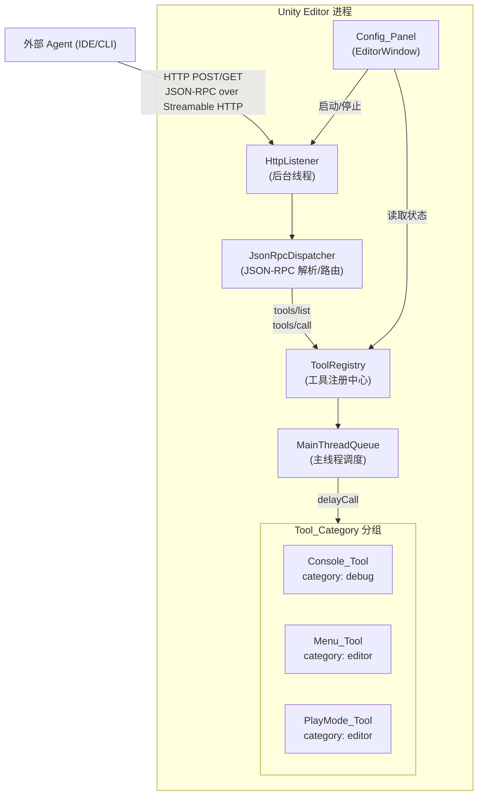

# Design Document

## Overview

本设计为 Unity Editor 提供一个最小可行的 MCP (Model Context Protocol) 服务插件。插件以 Unity Package 形式分发，在 Editor 进程内运行一个轻量 HTTP 服务端，实现 MCP 2025-03-26 规范中的 Streamable HTTP 传输层。外部 Agent 通过标准 MCP 协议发现和调用工具。

核心设计决策：
- **传输层选择 Streamable HTTP**：MCP 规范已废弃旧版 HTTP+SSE，Streamable HTTP 是当前标准远程传输方式。服务端暴露单一 HTTP 端点，支持 POST（发送 JSON-RPC 消息）和 GET（可选 SSE 流）。
- **进程内运行**：MCP Server 直接运行在 Unity Editor 主进程中，通过 `HttpListener` 在 Editor 线程外接收请求，再通过 `EditorApplication.delayCall` 调度回主线程执行 Unity API。无需外部 Node.js/Python 进程。
- **基于接口的工具注册**：所有工具实现统一接口 `IMcpTool`，通过反射自动发现并注册到 `ToolRegistry`，新增工具零修改核心代码。

## Out of Scope（MVP 不包含）

以下内容明确不在本次 MVP 范围内：

- **SSE 服务端推送**：Streamable HTTP 的 GET SSE 流仅做协议占位，不实现主动推送通知
- **多 Agent 并发**：MVP 仅支持单 Agent 连接，不处理并发请求竞争
- **Tool 热加载**：工具列表在服务启动时确定，运行期间新增工具需重启服务
- **远程/跨机器访问**：仅监听 `localhost`，不支持远程连接或认证鉴权
- **Notification / Sampling / Roots**：MCP 规范中的可选能力（notifications、sampling、roots）均不实现
- **日志持久化与导出**：Console_Tool 仅读取内存中的日志缓冲区，不做持久化存储

## Architecture



### 请求处理流程

```
Agent HTTP POST → HttpListener(后台线程) → JsonRpcDispatcher 解析
  ├─ initialize → 返回 server capabilities
  ├─ tools/list → ToolRegistry.ListAll() → 返回工具清单
  └─ tools/call → ToolRegistry.Resolve(name)
                    → MainThreadQueue.Enqueue(tool.Execute)
                    → 主线程执行 Unity API
                    → 返回结果
```

### 关键约束

- 所有代码位于 `Editor` 程序集（Assembly Definition: `Editor` only）
- Unity API 调用必须在主线程执行
- `HttpListener` 在后台线程运行，通过队列与主线程通信
- 服务停止时释放所有线程和端口资源

## Components and Interfaces

组件优先级：

| 优先级 | 组件 | 说明 |
|--------|------|------|
| MVP 必须 | McpServer, HttpListener, JsonRpcDispatcher, MainThreadQueue | 核心通信链路 |
| MVP 必须 | ToolRegistry, IMcpTool | 工具注册与发现 |
| MVP 必须 | ConsoleTool, MenuTool, PlayModeTool | 三个内置工具 |
| 可延后 | ConfigPanel 完整 UI | 最简版（启停+状态）即可，完整 UI 可后续迭代 |

### 1. IMcpTool（工具统一接口）

```
interface IMcpTool
    Name       : string          // 工具名称，如 "console_getLogs"
    Category   : string          // 所属分类，如 "debug"
    Description: string          // 工具描述
    InputSchema: JsonObject      // JSON Schema 描述参数
    Execute(params) → Result     // 执行工具逻辑，返回结果或错误
```

### 2. ToolRegistry（工具注册中心）

```
class ToolRegistry
    - tools: Dictionary<string, IMcpTool>   // name → tool

    Register(tool: IMcpTool)                // 注册单个工具
    AutoDiscover()                          // 反射扫描所有 IMcpTool 实现并注册
    Resolve(name: string) → IMcpTool?       // 按名称查找
    ListAll() → List<ToolInfo>              // 返回按 Category 分组的工具清单
    ListByCategory(cat: string) → List<ToolInfo>
```

自动发现机制：Editor 程序集加载时，通过反射扫描所有实现 `IMcpTool` 的非抽象类，自动实例化并注册。新增工具只需实现接口，无需修改任何已有代码。

### 3. McpServer（服务核心）

```
class McpServer
    - httpListener: HttpListener
    - toolRegistry: ToolRegistry
    - mainThreadQueue: MainThreadQueue
    - connectedAgents: int
    - isRunning: bool
    - port: int

    Start(port)          // 启动 HttpListener，开始监听
    Stop()               // 停止监听，断开所有连接，释放资源
    HandleRequest(ctx)   // 处理单个 HTTP 请求（后台线程）
```

### 4. JsonRpcDispatcher（协议分发）

```
class JsonRpcDispatcher
    Dispatch(jsonBody: string) → string
        // 解析 JSON-RPC 请求
        // 路由到对应 handler:
        //   "initialize"  → 返回 capabilities
        //   "tools/list"  → ToolRegistry.ListAll()
        //   "tools/call"  → ToolRegistry.Resolve + Execute
        //   其他          → MethodNotFound 错误
```

### 5. MainThreadQueue（主线程调度）

```
class MainThreadQueue
    Enqueue(action: Func<Task<Result>>)
    // 内部通过 EditorApplication.update 回调逐帧消费队列
    // 确保 Unity API 调用在主线程执行
```

### 6. McpServerManager（生命周期管理）

```
[InitializeOnLoad]
static class McpServerManager
    // 静态单例，服务独立于 ConfigPanel 窗口
    // Domain Reload 后通过 EditorPrefs(McpServer_Active) 检测并自动重启
    StartServer(port)    // 创建 ToolRegistry + AutoDiscover + MainThreadQueue + McpServer
    StopServer()         // 停止并清理所有资源，清除 EditorPrefs 标记
```

### 7. ConfigPanel（EditorWindow）【可延后】

> 优先级说明：ConfigPanel 为纯 UI 视图，服务生命周期由 McpServerManager 管理。关闭窗口不停止服务。

```
class ConfigPanel : EditorWindow
    // 菜单入口: Window/MCP Server
    // UI 元素:
    //   - 端口输入框 (默认 8090)
    //   - 启动/停止按钮
    //   - 服务状态指示 (Running/Stopped)
    //   - 已连接 Agent 数量
    //   - 错误信息显示区
    //   - Agent 配置 JSON 展示区（含一键复制按钮）
```

### 8. 三个内置工具

| 工具类 | Name | Category | 功能 |
|--------|------|----------|------|
| ConsoleTool | `console_getLogs` | `debug` | 获取最近 N 条日志（级别+时间戳+内容） |
| MenuTool | `menu_execute` | `editor` | 按路径执行 Unity 菜单项 |
| PlayModeTool | `playmode_control` | `editor` | 进入/退出/查询 PlayMode 状态 |

## Data Models

### JSON-RPC 请求/响应

```json
// 请求
{ "jsonrpc": "2.0", "id": 1, "method": "tools/call",
  "params": { "name": "console_getLogs", "arguments": { "count": 10 } } }

// 成功响应
{ "jsonrpc": "2.0", "id": 1,
  "result": { "content": [{ "type": "text", "text": "..." }] } }

// 错误响应
{ "jsonrpc": "2.0", "id": 1,
  "error": { "code": -32601, "message": "Method not found" } }
```

### Console 日志条目

```json
{
  "level": "Error",           // "Log" | "Warning" | "Error"
  "timestamp": "2025-01-15T10:30:00Z",
  "message": "NullReferenceException: ..."
}
```

### 工具列表响应（tools/list）

```json
{
  "tools": [
    {
      "name": "console_getLogs",
      "description": "获取 Unity Console 最近 N 条日志",
      "category": "debug",
      "inputSchema": {
        "type": "object",
        "properties": {
          "count": { "type": "integer", "description": "日志条数", "default": 20 }
        }
      }
    }
  ]
}
```

### PlayMode 控制参数

```json
// 请求参数
{ "action": "enter" | "exit" | "status" }

// 状态响应
{ "status": "Playing" | "Stopped" }
```

### 服务配置

```json
{
  "port": 8090,
  "autoStart": false
}
```

配置持久化使用 `EditorPrefs`，key 前缀 `McpServer_`。


## Correctness Properties

*A property is a characteristic or behavior that should hold true across all valid executions of a system — essentially, a formal statement about what the system should do. Properties serve as the bridge between human-readable specifications and machine-verifiable correctness guarantees.*

### Property 1: Console 日志检索正确性

*For any* 日志缓冲区（包含任意数量、任意级别的日志条目）和任意请求条数 N，Console_Tool 返回的结果应满足：
- 返回条数 = min(N, 缓冲区总数)
- 返回的每条日志包含 level（Log/Warning/Error）、timestamp 和 message 三个字段
- 返回的日志是缓冲区中最近的 min(N, 总数) 条，且顺序一致

**Validates: Requirements 2.1, 2.2, 2.3, 2.4**

### Property 2: 无效菜单路径返回错误

*For any* 不属于合法 Unity 菜单路径集合的字符串，Menu_Tool 执行时应返回包含错误信息的响应，且不产生任何副作用

**Validates: Requirements 3.2**

### Property 3: PlayMode 状态查询一致性

*For any* PlayMode 状态（Playing 或 Stopped），PlayMode_Tool 的 status 查询返回值应与 Unity Editor 的实际 PlayMode 状态一致

**Validates: Requirements 4.3**

### Property 4: ToolRegistry 注册完整性与分组正确性

*For any* 一组已注册的 IMcpTool 实例（具有任意 name、category、description），ToolRegistry 应满足：
- ListAll() 返回的工具数量等于注册数量
- 每个工具的 name、category、description 与注册时一致
- ListByCategory(cat) 返回的工具均属于该 category，且不遗漏

**Validates: Requirements 6.1, 6.3, 6.4**

## Error Handling

| 场景 | 处理方式 |
|------|----------|
| 端口被占用 | `Start()` 捕获 `HttpListenerException`，设置错误状态，Config_Panel 显示端口冲突提示 |
| 无效 JSON-RPC 请求 | 返回 JSON-RPC Parse Error (-32700) |
| 未知 method | 返回 JSON-RPC Method Not Found (-32601) |
| 工具名不存在 | 返回 JSON-RPC Invalid Params (-32602)，message 中包含工具名 |
| 菜单路径不存在 | `EditorApplication.ExecuteMenuItem` 返回 false，工具返回业务错误 |
| 工具执行异常 | 捕获异常，返回 JSON-RPC Internal Error (-32603)，message 包含异常信息 |
| 主线程调度超时 | 设置合理超时（如 10s），超时返回 Internal Error |
| 重复进入/退出 PlayMode | 检测当前状态，返回提示信息而非执行操作 |
| Editor 域重载 (Domain Reload) | McpServerManager 通过 EditorPrefs 标记自动恢复服务，无需手动重启 |

## Testing Strategy

### 单元测试

使用 Unity Test Framework (NUnit) 编写，覆盖以下场景：

- **ToolRegistry**: 注册、查找、按分类列出、重复注册处理
- **JsonRpcDispatcher**: 合法请求路由、非法 JSON 解析、未知 method 错误码
- **ConsoleTool**: 正常取日志、空日志、请求数超出可用数
- **MenuTool**: 合法路径执行、非法路径错误响应
- **PlayModeTool**: 进入/退出/查询、重复进入/退出的提示信息
- **MainThreadQueue**: 入队/出队、主线程执行验证

### 属性测试 (Property-Based Testing)

使用 [FsCheck](https://github.com/fscheck/FsCheck) (NuGet，兼容 Unity 2022+ 的 .NET Standard 2.1)。

> **FsCheck 兼容性说明**：FsCheck 3.x 目标为 .NET Standard 2.0，Unity 2022+ 支持 .NET Standard 2.1，理论兼容。但 Unity 的 NuGet 集成非标准，需通过 [NuGetForUnity](https://github.com/GlitchEnzo/NuGetForUnity) 或手动导入 DLL。若集成遇阻，备选方案：(1) 在独立 .NET 项目中运行属性测试，引用 Editor 程序集的纯逻辑类；(2) 使用轻量替代库如手写简易随机生成器配合 NUnit `[TestCase]` 覆盖关键属性。

每个属性测试最少运行 100 次迭代，测试标签格式：

```
// Feature: unity-mcp-minimum-experiment, Property 1: Console 日志检索正确性
// Feature: unity-mcp-minimum-experiment, Property 2: 无效菜单路径返回错误
// Feature: unity-mcp-minimum-experiment, Property 3: PlayMode 状态查询一致性
// Feature: unity-mcp-minimum-experiment, Property 4: ToolRegistry 注册完整性与分组正确性
```

属性测试聚焦于纯逻辑层（ToolRegistry、ConsoleTool 的日志过滤逻辑），通过 mock/stub 隔离 Unity API 依赖。

### 集成测试

在 Unity Editor 环境中运行，验证端到端流程：
- 启动服务 → HTTP 连接 → tools/list → tools/call → 停止服务
- 端口冲突处理
- Domain Reload 后的状态恢复

### 业务验收标准

MVP 交付需满足以下条件：

1. 外部 Agent（如 Claude Desktop / Cursor）能通过 `http://localhost:8090` 成功完成 `initialize` → `tools/list` → `tools/call` 全流程
2. `console_getLogs` 能正确返回 Unity Console 中最近 N 条日志（含级别、时间戳、内容）
3. `menu_execute` 能成功执行至少一个标准菜单项（如 `Window/MCP Server`），非法路径返回明确错误
4. `playmode_control` 能正确进入/退出 PlayMode 并查询状态
5. 服务启停不影响 Unity Editor 正常编辑工作流，停止后不残留端口占用或后台线程
